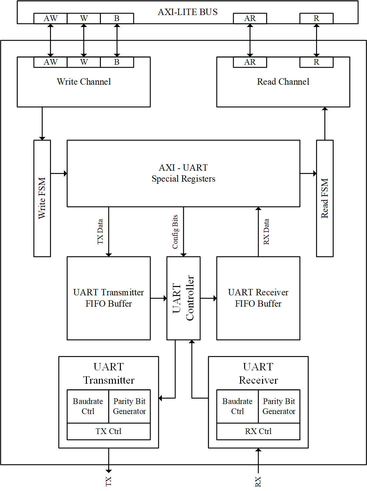

# RISC-V Baseboard Management Controller (BMC) System-on-Chip

[-blue.svg)](#3-processor-core-architecture-veer-el2)
[](#4-interconnect-architecture-64-bit-axi4-3x8-crossbar)
[](#8-simulation--verification-commands)
[](#7-environment-setup--prerequisites)
[-brightgreen.svg)](#9-verification-results--simulation-logs)

---

## 1. Project Overview & Motivation

Modern hyperscale datacenters, cloud infrastructure, and enterprise servers depend on an autonomous, out-of-band supervisor known as a **Baseboard Management Controller (BMC)** (commercially deployed as Dell iDRAC, HPE iLO, or OpenBMC platforms). The BMC operates independently of the host CPU, main operating system, and primary power supply to continuously monitor hardware health, detect system hangs, perform hardware power cycling, enforce recovery policies, and provide remote management telemetry.

This project implements a complete, synthesizable **RISC-V-based Server Baseboard Management Controller (BMC) System-on-Chip (SoC)** built around the **Western Digital / CHIPS Alliance VeeR EL2** 32-bit RISC-V processor core.

```
+----------------------------------------------------------------------------------------------------+
|                                    BMC SYSTEM-ON-CHIP (SoC)                                        |
|                                                                                                    |
|  +--------------------+      +--------------------+      +--------------------+      +----------+  |
|  |   VeeR EL2 Core    |      |  64-bit AXI4 3x8   |      | Custom BMC IPs     |      | External |  |
|  |  (RV32IMC, 100MHz) | <--> | Interconnect Cross | <--> | - Heartbeat Mon    | <--> | Host CPU |  |
|  |  - 64KB DCCM (ECC) |      | - LSU / IFU / SB   |      | - Reset Sequencer  |      | System   |  |
|  +--------------------+      +--------------------+      | - Recovery Policy  |      +----------+  |
|                                                          | - VGA Dashboard    |                    |
|  +--------------------+      +--------------------+      | - 16550 AXI UART   |      +----------+  |
|  | 8KB Boot AXI ROM   | <--> | Address Steering   |      | - Timer / GPIO     | <--> | Operator |  |
|  | (firmware.hex)     |      | 64-bit to 32-bit   |      +--------------------+      | Terminal |  |
|  +--------------------+      +--------------------+                                  +----------+  |
+----------------------------------------------------------------------------------------------------+
```

### Core Design Philosophy: Hardware-Enforced Reliability
In standard server architectures, watchdog software executing on the main CPU can fail if the operating system deadlocks, interrupts are masked, or kernel panics occur. This BMC SoC enforces a strict architectural separation:
1. **Autonomous Hardware Detection**: The **Heartbeat Monitor IP** tracks pulse edges directly in hardware registers. If the host stops strobing within a programmed window, the hardware instantly triggers a timeout without requiring software intervention.
2. **Deterministic Hardware Recovery**: The **Power/Reset Sequencer IP** independently controls the host reset line, generating precise active-low reset pulses with programmable hold durations.
3. **Hardware Crash-Loop Protection**: The **Recovery Policy IP** tracks recovery frequency across a rolling time window. If the host enters a rapid reboot loop (crash loop), the IP asserts an unmaskable **lockout** to prevent damage to disks and hardware, preserving system state for root-cause analysis.
4. **Out-of-Band Operator Visibility**: Telemetry is streamed over a **16550-compatible AXI-Lite UART** and rendered directly to a **640x480 @ 60Hz VGA text dashboard**.

---

## 2. Top-Level SoC Architecture

The top-level SoC integrates the VeeR EL2 processor core, a 64-bit 3-Master $\times$ 8-Slave AXI4 crossbar interconnect, dedicated 64-to-32 bit bus width converters, an 8KB boot ROM, dual-bank DCCM SRAM with ECC, and seven memory-mapped peripheral controllers.

### Top-Level Block Diagram


### Top-Level External Signal Interface

| Signal Name | Direction | Width | Domain | Functional Description |
| :--- | :---: | :---: | :---: | :--- |
| `clk` | Input | 1 | Clock | Primary system clock (100 MHz nominal) |
| `rst_n` | Input | 1 | Reset | Active-low asynchronous master system reset |
| `heartbeat_in` | Input | 1 | Monitored | Periodic heartbeat strobe from external host server CPU |
| `reset_out` | Output | 1 | Monitored | Active-low hardware reset signal driving host power circuitry |
| `uart_rx` | Input | 1 | Management | Serial receive line from remote management console |
| `uart_tx` | Output | 1 | Management | Serial transmit line streaming boot logs and telemetry (115200 baud) |
| `vga_hsync` | Output | 1 | Video | VGA horizontal synchronization pulse (31.468 kHz) |
| `vga_vsync` | Output | 1 | Video | VGA vertical synchronization pulse (59.94 Hz) |
| `vga_rgb` | Output | 12 | Video | 12-bit digital RGB color output (`[11:8]` Red, `[7:4]` Green, `[3:0]` Blue) |
| `jtag_tck` | Input | 1 | Debug | JTAG Test Clock input to VeeR EL2 debug unit |
| `jtag_tms` | Input | 1 | Debug | JTAG Test Mode Select input |
| `jtag_tdi` | Input | 1 | Debug | JTAG Test Data In |
| `jtag_tdo` | Output | 1 | Debug | JTAG Test Data Out |

---

## 3. Processor Core Architecture: VeeR EL2

The processor core is the **VeeR EL2** (formerly SweRV EL2), a high-performance, dual-issue superscalar 32-bit RISC-V core designed by Western Digital and maintained by CHIPS Alliance.

<p align="center">
  
  
</p>

### Key Processor Features
- **ISA Support**: RV32IMC (Base Integer 32-bit, Integer Multiplication/Division, Compressed Instructions) plus Bitmanip extensions (Zba, Zbb, Zbc, Zbs) and CSR (`_zicsr`).
- **Pipeline Structure**: 4-stage in-order, dual-issue superscalar execution pipeline.
- **Tightly Coupled Memories (TCM)**:
  - **DCCM (Data Closely Coupled Memory)**: 64 KB total organized as 4 banks $\times$ 4096 entries $\times$ 39 bits (32-bit data + 7-bit ECC per bank), mapped internally at `0xF004_0000`.
  - **ICCM (Instruction Closely Coupled Memory)**: Configured in bypass mode for direct AXI instruction streaming from boot ROM.
- **Bus Interfaces**: Three independent 64-bit AXI4 master interfaces:
  - **IFU Master** (`ifu_axi_*`): Instruction Fetch Unit streaming code from AXI ROM (`0x8000_0000`).
  - **LSU Master** (`lsu_axi_*`): Load/Store Unit accessing memory-mapped peripherals (`0x0002_0000` - `0x0002_06FF`).
  - **System Bus Master** (`sb_axi_*`): Debug module and auxiliary bus bridge.
- **Programmable Interrupt Controller (PIC)**: Core-integrated PIC supporting up to 31 external interrupt lines.

### Interrupt Architecture & PIC Mapping
<p align="center">
  
</p>

The SoC routes hardware interrupt request lines from peripheral IPs directly into the VeeR core's `extintsrc_req` vector:
- **Bit 0**: `uart_irq` (UART RX character available / FIFO threshold)
- **Bit 1**: `hb_irq` (Heartbeat Monitor timeout assertion)
- **Bit 2**: `vblank_irq` (VGA vertical blank frame start)
- **Bit 3**: `lockout_irq` (Recovery Policy crash-loop lockout threshold exceeded)
- **Bits [30:4]**: Reserved (tied to `1'b0`)

---

## 4. Interconnect Architecture: 64-bit AXI4 3x8 Crossbar

The SoC integrates a high-performance **3-Master $\times$ 8-Slave 64-bit AXI4 Interconnect Crossbar** (`axi_interconnect_wrap_3x8`) generated specifically for this architecture:

```
                                  +------------------------------------+
                                  |       VeeR EL2 RISC-V Core         |
                                  +------------------------------------+
                                     | IFU (64b)   | LSU (64b)   | SB (64b)
                                     v             v             v
                                  +------------------------------------+
                                  |    S00           S01           S02   |
                                  |   AXI4 3x8 Interconnect Crossbar   |
                                  |   (64-bit Data, 32-bit Address)    |
                                  +------------------------------------+
                                     |   |   |   |   |   |   |   |
         +---------------------------+   |   |   |   |   |   |   +---------------------------+
         |                               |   |   |   |   |   |                               |
         v (M00)                         v   v   v   v   v   v (M06)                         v (M07)
+------------------+                    +---------------------+                    +------------------+
| 64b->32b Adapter |                    | Native 64b AXI      |                    | External AXI ROM |
|        v         |                    | Wrappers (M01-M06)  |                    | 8 KB @ 0x80000000|
| 16550 UART IP    |                    | - Timer (M01)       |                    | (firmware.hex)   |
| (0x0002_0000)    |                    | - GPIO (M02)        |                    +------------------+
+------------------+                    | - Heartbeat (M03)   |
                                        | - Reset Seq (M04)   |
                                        | - Policy/Log (M05)  |
                                        | - VGA Ctrl (M06)    |
                                        +---------------------+
```

### Bus Width Steering & Lane Adaptation
Because the VeeR EL2 LSU and IFU operate over a native 64-bit data bus (`[63:0]`) while peripherals are 32-bit word-aligned, each peripheral wrapper incorporates inline dynamic data steering:
- **Write Path**: Address bit `addr[2]` steers the active 32-bit word:
  - If `addr[2] == 0`: `wdata_32 = axi_wdata[31:0]`, `wstrb_4 = axi_wstrb[3:0]`
  - If `addr[2] == 1`: `wdata_32 = axi_wdata[63:32]`, `wstrb_4 = axi_wstrb[7:4]`
- **Read Path**: The 32-bit peripheral output is replicated across both halves:
  - `axi_rdata = {rdata_32, rdata_32}`
  This guarantees that whether the CPU issues a load on the lower word lane or the upper word lane, the data is available on the expected byte positions.

---

## 5. Detailed IP Micro-Architecture & Block Diagrams

### 5.1 Heartbeat Monitor IP (`axi_heartbeat_monitor`)
The Heartbeat Monitor continuously validates system health by measuring the elapsed time between consecutive rising edges on the `heartbeat_in` pin.


#### Internal State Machine & Operation
- **States**: `DISABLED (00)` $\rightarrow$ `IDLE (01)` $\rightarrow$ `COUNTING (10)` $\rightarrow$ `UNRESPONSIVE (11)`.
- **Edge Detector**: Double-registers `heartbeat_in` to prevent metastability and detects positive edges.
- **Elapsed Counter**: Increments on each clock cycle. A valid heartbeat edge clears the counter back to zero.
- **Threshold Comparator**: If `hb_counter >= hb_threshold_reg`, the FSM transitions to `UNRESPONSIVE`, asserts `hb_irq`, and latches a sticky status flag.
- **Sticky Flag Protection**: Once set, `unresponsive` cannot be cleared by subsequent heartbeat pulses; only explicit firmware intervention via `HB_CTRL[1]` can clear the fault state.

---

### 5.2 Power/Reset Sequencer IP (`axi_reset_sequencer`)
The Power/Reset Sequencer executes hardware-timed, active-low reset sequences targeting the host processor's power and reset management subsystem.


#### Internal State Machine & Timing
- **States**: `IDLE (00)` $\rightarrow$ `ASSERT (01)` $\rightarrow$ `DEASSERT (10)` $\rightarrow$ `DONE (11)`.
- **Trigger**: Writing `1'b1` to `RST_CTRL[0]` initiates the sequence.
- **Hold Duration**: The active-low pulse duration is determined by `RST_HOLD_CYCLES` (default 100 cycles, programmable from 1 to $2^{32}-1$).
- **Atomic Execution**: Trigger writes received while a sequence is already active are ignored, guaranteeing clean pulse timing without runt pulses.
- **Status Reporting**: Exposes `in_progress` (bit 0) and a sticky `complete` (bit 1) indicator.

---

### 5.3 Recovery Policy & Circular Event Log IP (`axi_recovery_policy`)
The Recovery Policy engine guards against "restart storms" and crash looping. It maintains a 16-deep circular timestamp log and tracks failure frequency across a rolling time window.


#### Crash-Loop Lockout Algorithm
1. When firmware triggers a recovery, it stages the current system uptime timestamp into `POL_EVENT_TS` and asserts `POL_CTRL[0]` (`record_event`).
2. The hardware writes the timestamp into circular RAM buffer `log_buffer[log_wr_ptr]`, advances `log_wr_ptr = (log_wr_ptr + 1) % 16`, and increments `log_count`.
3. The hardware increments `window_recovery_count`.
4. If `window_recovery_count >= policy_threshold_reg`, the hardware latches `lockout_flag = 1'b1` and raises `lockout_irq`.
5. When locked out, automated recoveries are blocked until an operator explicitly issues `POL_CTRL[1]` (`clear_lockout`).
6. A free-running window counter resets `window_recovery_count` every `policy_window_reg` clock cycles to measure frequency rather than cumulative lifetime resets.

---

### 5.4 VGA Status Dashboard Controller (`axi_vga_controller`)
Provides an autonomous visual status console generating standard 640x480 @ 60Hz video timing directly from an internal 120-character ASCII text buffer.


#### Display Parameters & Text Engine
- **Pixel Clock**: 25.175 MHz generated via an internal divide-by-4 counter from the 100 MHz system clock.
- **Resolution**: 640 $\times$ 480 pixels, 60 Hz vertical refresh rate (31.468 kHz horizontal rate).
- **Text Grid**: 3 rows $\times$ 40 columns (120 characters total).
- **Memory Buffer**: Mapped across 30 words (4 packed characters per 32-bit register).
- **Color Palette**: High-contrast, server-grade console style: crisp green text (`12'h0F0`) rendered against a dark blue background (`12'h002`).

---

### 5.5 16550-Compatible AXI-Lite UART IP (`axi_uart_top`)
The serial management console is powered by a synthesizable 16550-compatible UART IP connected natively to AXI Crossbar Master Port 0 (`0x0002_0000`).

<p align="center">
  
</p>

#### Features
- Full software compatibility with National Semiconductor 16550 register definitions.
- Configurable baud divisor (`BAUD_DIV = clock_hz / (16 * baud)`). In simulation, an accelerated divisor (`BAUD_DIV = 16`) provides fast console streaming.
- Hardware transmit holding register empty (`THRE`) and receiver data ready (`DR`) flags.

---

## 6. Complete Memory Map & Register Reference

### System Memory Map Summary

| Slave Port | Base Address | Address Range | Size | Peripheral / Target Description | Protocol |
| :---: | :---: | :---: | :---: | :--- | :--- |
| — | `0x0000_0000` | `0x0000_0000` – `0x0000_FFFF` | 64 KB | ICCM (Instruction Memory) | Core TCM |
| — | `0xF004_0000` | `0xF004_0000` – `0xF004_FFFF` | 64 KB | DCCM (Data Memory with 7-bit ECC) | Core TCM |
| **Slave 0** | `0x0002_0000` | `0x0002_0000` – `0x0002_00FF` | 256 B | **16550 UART Serial Controller** | AXI4-Lite |
| **Slave 1** | `0x0002_0100` | `0x0002_0100` – `0x0002_01FF` | 256 B | **32-bit System Uptime Timer** | AXI4-Lite |
| **Slave 2** | `0x0002_0200` | `0x0002_0200` – `0x0002_02FF` | 256 B | **GPIO Pin Status Register** | AXI4-Lite |
| **Slave 3** | `0x0002_0300` | `0x0002_0300` – `0x0002_03FF` | 256 B | **Heartbeat Monitor IP** | AXI4-Lite |
| **Slave 4** | `0x0002_0400` | `0x0002_0400` – `0x0002_04FF` | 256 B | **Power/Reset Sequencer IP** | AXI4-Lite |
| **Slave 5** | `0x0002_0500` | `0x0002_0500` – `0x0002_05FF` | 256 B | **Recovery Policy & Event Log** | AXI4-Lite |
| **Slave 6** | `0x0002_0600` | `0x0002_0600` – `0x0002_06FF` | 256 B | **VGA Status Dashboard Controller** | AXI4-Lite |
| **Slave 7** | `0x8000_0000` | `0x8000_0000` – `0x8000_1FFF` | 8 KB | **External AXI Boot ROM (Firmware)**| AXI4 |

---

### Detailed Register Specifications

#### Slave 0: UART Serial Controller (`0x0002_0000`)
| Offset | Register Name | Access | Reset | Description |
| :---: | :--- | :---: | :---: | :--- |
| `0x00` | `UART_RBR` | RO | `0x00` | Receive Buffer Register (read incoming character byte) |
| `0x00` | `UART_THR` | WO | `0x00` | Transmit Holding Register (write outgoing character byte) |
| `0x04` | `UART_IER` | R/W | `0x00` | Interrupt Enable Register (`bit[0]` = RX Data Available IRQ) |
| `0x08` | `UART_IIR` | RO | `0x01` | Interrupt Identification Register |
| `0x08` | `UART_FCR` | WO | `0x00` | FIFO Control Register |
| `0x0C` | `UART_LCR` | R/W | `0x00` | Line Control Register (`bit[7]` = DLAB, `bit[1:0]` = 8-bit word) |
| `0x14` | `UART_LSR` | RO | `0x60` | Line Status (`bit[0]` = DR, `bit[5]` = THRE Transmitter Empty) |

#### Slave 1: 32-bit System Timer (`0x0002_0100`)
| Offset | Register Name | Access | Reset | Description |
| :---: | :--- | :---: | :---: | :--- |
| `0x00` | `TMR_CTR` | RO | `0x00000000` | 32-bit free-running system uptime tick counter (increments every clock cycle) |

#### Slave 2: GPIO Pin Status (`0x0002_0200`)
| Offset | Register Name | Access | Reset | Description |
| :---: | :--- | :---: | :---: | :--- |
| `0x00` | `GPIO_STAT` | RO | `0x00000002` | `bit[0]`: Current state of `heartbeat_in` pin<br/>`bit[1]`: Current state of `reset_out` pin (1 = inactive) |

#### Slave 3: Heartbeat Monitor (`0x0002_0300`)
| Offset | Register Name | Access | Reset | Description |
| :---: | :--- | :---: | :---: | :--- |
| `0x00` | `HB_CTRL` | R/W | `0x00000000` | `bit[0]`: Enable monitor (1 = active)<br/>`bit[1]`: Clear unresponsive flag (self-clearing) |
| `0x04` | `HB_THRESHOLD` | R/W | `0x00000000` | Max clock cycles allowed between consecutive heartbeat edges |
| `0x08` | `HB_STATUS` | RO | `0x00000000` | `bit[0]`: Sticky unresponsive flag (1 = host timed out)<br/>`bit[1]`: Live sample of `heartbeat_in` |
| `0x0C` | `HB_ELAPSED` | RO | `0x00000000` | Instantaneous cycle count since last observed heartbeat edge |

#### Slave 4: Power/Reset Sequencer (`0x0002_0400`)
| Offset | Register Name | Access | Reset | Description |
| :---: | :--- | :---: | :---: | :--- |
| `0x00` | `RST_CTRL` | WO | `0x00000000` | `bit[0]`: Trigger reset pulse (self-clearing single-cycle strobe) |
| `0x04` | `RST_HOLD_CYCLES` | R/W | `0x00000064` | Reset pulse hold duration in clock cycles (default = 100 cycles) |
| `0x08` | `RST_STATUS` | RO | `0x00000000` | `bit[0]`: Reset sequence active (`in_progress`)<br/>`bit[1]`: Sequence finished (`complete`, sticky) |

#### Slave 5: Recovery Policy & Circular Event Log (`0x0002_0500`)
| Offset | Register Name | Access | Reset | Description |
| :---: | :--- | :---: | :---: | :--- |
| `0x00` | `POL_CTRL` | WO | `0x00000000` | `bit[0]`: Record event timestamp<br/>`bit[1]`: Clear lockout state (self-clearing) |
| `0x04` | `POL_WINDOW` | R/W | `0x00000000` | Rolling evaluation window size in clock cycles |
| `0x08` | `POL_THRESHOLD` | R/W | `0x00000000` | `bit[7:0]`: Maximum recoveries allowed per window before lockout |
| `0x0C` | `POL_STATUS` | RO | `0x00000000` | `bit[0]`: Lockout active flag<br/>`bit[15:8]`: Current window recovery count |
| `0x10` | `POL_EVENT_TS` | WO | `0x00000000` | Staging register: timestamp to be written to circular log |
| `0x14` | `LOG_READ_IDX` | R/W | `0x00000000` | `bit[3:0]`: Pointer index (0–15) into circular event log |
| `0x18` | `LOG_READ_DATA` | RO | `0x00000000` | Stored 32-bit timestamp entry at `LOG_READ_IDX` |
| `0x1C` | `LOG_COUNT` | RO | `0x00000000` | Cumulative lifetime recovery events logged |

#### Slave 6: VGA Status Dashboard (`0x0002_0600`)
| Offset | Register Name | Access | Reset | Description |
| :---: | :--- | :---: | :---: | :--- |
| `0x00` | `VGA_CTRL` | R/W | `0x00000000` | `bit[0]`: Video output enable (1 = active display, 0 = blank) |
| `0x04` | `VGA_STATUS` | RO | `0x00000000` | `bit[0]`: Frame refresh flag (cleared at start of frame) |
| `0x08`–`0x7C` | `VGA_BUFFER[0..29]`| WO | `0x20202020` | 30 words $\times$ 4 characters = 120 ASCII text buffer bytes (3 rows $\times$ 40 cols) |

---

## 7. Environment Setup & Prerequisites

### 7.1 Operating System Requirements
- **Linux Distribution**: Ubuntu 20.04 / 22.04 / 24.04 LTS, Debian 11 / 12, RHEL / Rocky Linux 8 / 9.
- **Base Packages**:
  ```bash
  # Ubuntu / Debian
  sudo apt update && sudo apt install -y build-essential git make curl wget tar xz-utils python3 python3-pip ninja-build libfl-dev zlib1g-dev

  # RHEL / Rocky Linux / CentOS
  sudo dnf install -y gcc gcc-c++ git make curl wget tar xz python3 python3-pip flex bison zlib-devel
  ```

### 7.2 RISC-V Cross-Compiler Toolchain Setup
The firmware build flow requires `riscv64-unknown-elf-gcc` configured with RV32IMC architecture support:
```bash
# 1. Create a local toolchain directory
mkdir -p ~/.local/riscv && cd ~/.local/riscv

# 2. Download prebuilt xPack GNU RISC-V Embedded GCC (v14.2.0-2)
wget https://github.com/xpack-dev-tools/riscv-none-elf-gcc-xpack/releases/download/v14.2.0-2/xpack-riscv-none-elf-gcc-14.2.0-2-linux-x64.tar.gz
tar -xzf xpack-riscv-none-elf-gcc-14.2.0-2-linux-x64.tar.gz

# 3. Create global symlinks for riscv64-unknown-elf-*
mkdir -p ~/.local/bin
XDIR=~/.local/riscv/xpack-riscv-none-elf-gcc-14.2.0-2/bin
for tool in gcc g++ ar as ld nm objcopy objdump ranlib size strings strip; do
  ln -sf $XDIR/riscv-none-elf-$tool ~/.local/bin/riscv64-unknown-elf-$tool
  ln -sf $XDIR/riscv-none-elf-$tool ~/.local/bin/riscv32-unknown-elf-$tool
done

# 4. Add to PATH in ~/.bashrc
export PATH="$HOME/.local/bin:$PATH"
source ~/.bashrc
```

Verify the compiler:
```bash
riscv64-unknown-elf-gcc --version
```

### 7.3 Synopsys VCS & Verdi Tool Configuration
Ensure your EDA environment variables and Synopsys license path are exported:
```bash
export VCS_HOME=/path/to/vcs/U-2023.03
export VERDI_HOME=/path/to/verdi/U-2023.03-SP1
export SNPSLMD_LICENSE_FILE=27021@your-license-server
export PATH=$VCS_HOME/bin:$VERDI_HOME/bin:$PATH
```

---

## 8. Simulation & Verification Commands

All build, compilation, simulation, and debug workflows are integrated into the master [`Makefile`](file:///home/student/Documents/sriv183/honour_soc/Makefile).

### Quick Command Reference Table

| Target Command | Description | Artifacts Generated |
| :--- | :--- | :--- |
| `make help` | Display built-in command reference menu | Terminal output |
| `make build_firmware` | Cross-compile C/ASM code into `program.hex` / `firmware.hex` | `program.elf`, `firmware.hex`, `program.dump` |
| `make sim_core` | **Run Full End-to-End Simulation** (VeeR EL2 Core + AXI ROM + UART Console) | `soc_core.fsdb`, console execution log |
| `make sim_soc` | Run Peripheral Subsystem integration testbench | `tb_soc_top.fsdb` |
| `make sim_axi` | Run Standalone 3x8 AXI Interconnect verification | `tb_axi_interconnect.fsdb` |
| `make sim_hbm` | Run Heartbeat Monitor standalone unit test | Terminal test output |
| `make sim_rst` | Run Reset Sequencer standalone unit test | Terminal test output |
| `make sim_pol` | Run Recovery Policy & Event Log standalone unit test | Terminal test output |
| `make compile_top` | Verify top-level RTL syntax and elaboration | Elaboration report (`simv_top_check`) |
| `make sim_all` | **Run Complete Regression Suite** (all unit + integration tests) | Full test pass report |
| `make waves_core` | Open Synopsys Verdi with full SoC + VeeR execution waves | Verdi GUI session |
| `make waves_soc` | Open Synopsys Verdi with peripheral subsystem waves | Verdi GUI session |
| `make waves_axi` | Open Synopsys Verdi with AXI interconnect waves | Verdi GUI session |
| `make clean` | Clean all compiled binaries, simv databases, and waveform files | Clean workspace |

---

### Step-by-Step Execution Guide

#### 1. Cross-Compile the Firmware
Compiles `firmware/start.S` and `firmware/main.c` using RV32IMC instructions, maps memory via `firmware/link.ld`, and generates `firmware.hex` (pre-shifted to address `0x0000_0000` for Verilog `$readmemh`):
```bash
make build_firmware TEST=main
```

#### 2. Execute Full End-to-End SoC Simulation
Compiles the complete hardware design with the VeeR EL2 core, loads `firmware.hex` into the AXI Boot ROM, boots from `0x8000_0000`, and streams UART logs directly to your shell in real time:
```bash
make sim_core
```

#### 3. Inspect Waveforms in Synopsys Verdi
Launch Verdi pre-configured with the Knowledge Database (`-kdb`) and signal layouts:
```bash
make waves_core
```

#### 4. Run the Full Regression Suite
Executes every unit test, the AXI interconnect test, the peripheral subsystem test, and the full SoC core test sequentially:
```bash
make sim_all
```

---

## 9. Verification Results & Simulation Logs

### Full SoC VeeR EL2 Core Execution Log (`make sim_core`)
```
================================================================
 [TB] BMC SoC System Simulation Initialized
 [TB] Clock: 100 MHz | UART Baud: 115200 (Divisor: 16)
 [TB] AXI ROM initialized with firmware.hex
================================================================

 [TB] Reset deasserted (rst_n = 1). VeeR EL2 core booting from 0x80000000...

====================================================
  BMC System-on-Chip: Complete Hardware IP Test Suite
  Processor Core: VeeR EL2 (RV32IMC Bare-Metal)
====================================================

[TEST 1] Verifying System Timer (TMR_CTR)...
  Timer t1: 0x0000948A, t2: 0x0000A114
  [PASS] Timer monotonic counter incrementing

[TEST 2] Verifying GPIO Pin Status (GPIO_STAT)...
  GPIO Status: 0x00000002
  [PASS] GPIO indicates reset_out HIGH (active-low deasserted)

[TEST 3] Verifying Heartbeat Monitor IP...
  [PASS] HB_THRESHOLD register write/readback (50000)
  [PASS] HB_STATUS unresponsive flag is CLEAR
  [PASS] HB_CTRL petting command executed successfully

[TEST 4] Verifying Power/Reset Sequencer IP...
  Default RST_HOLD_CYCLES: 100
  [PASS] RST_HOLD_CYCLES reset value is 100
  [PASS] RST_HOLD_CYCLES write/readback (60)
  [PASS] RST_STATUS indicates idle (not in progress)

[TEST 5] Verifying Recovery Policy & Event Log IP...
  [PASS] POL_WINDOW write/readback (200000)
  [PASS] POL_THRESHOLD write/readback (3)
  [PASS] POL_STATUS lockout cleared
  [PASS] LOG_COUNT updated to 1 after Event 1
  Log[0] Data: 0x11223344
  [PASS] Circular Log Entry 0 matches staged timestamp 0x11223344
  [PASS] LOG_COUNT updated to 2 after Event 2
  Log[1] Data: 0xAABBCCDD
  [PASS] Circular Log Entry 1 matches staged timestamp 0xAABBCCDD

[TEST 6] Verifying VGA Status Dashboard IP...
  [PASS] VGA_CTRL enable display
  [PASS] VGA text buffer programmed with status dashboard

====================================================
  TEST SUMMARY REPORT
====================================================
  Total Passed: 17
  Total Failed: 0

>>> ALL IP INTEGRATION TESTS PASSED SUCCESSFULLY! <<<

BMC Heartbeat Alive - System Healthy...

================================================================
 [TB] SIMULATION SUCCESS: All IP integration tests passed!
================================================================
```

### Regression Verification Matrix

| Test Suite | Target Name | Test Description | Tests | Status | Waveform Output |
| :--- | :--- | :--- | :---: | :---: | :--- |
| **SoC Core** | `make sim_core` | VeeR EL2 core boot, C firmware execution, all 6 IPs verified over AXI | 17 / 17 | **PASS** | `soc_core.fsdb` |
| **SoC Top** | `make sim_soc` | Peripheral subsystem stimulus, fault timeout, reset sequencing, lockout | 17 / 17 | **PASS** | `tb_soc_top.fsdb` |
| **AXI Crossbar**| `make sim_axi` | 3x8 Crossbar concurrent arbitration, address decoding, data width conversion | 18 / 18 | **PASS** | `tb_axi_interconnect.fsdb` |
| **Heartbeat** | `make sim_hbm` | Pulse timing, timeout detection, sticky flag latching, counter accuracy | 9 / 9 | **PASS** | `tb_heartbeat_monitor.vcd` |
| **Reset Seq** | `make sim_rst` | Active-low pulse duration, trigger-while-busy lock, status reporting | 12 / 12 | **PASS** | `tb_reset_sequencer.vcd` |
| **Policy/Log** | `make sim_pol` | Rolling window tracking, circular wrap (16 entries), crash-loop lockout | 16 / 16 | **PASS** | `tb_recovery_policy.vcd` |
| **Top Syntax** | `make compile_top`| Top-level RTL syntax check and structural elaboration | 0 errors | **PASS** | `simv_top_check` |

---

## 10. Repository File & Directory Structure

```
honour_soc/
├── Makefile                               # Master verification & build automation script
├── README.md                              # Authoritative project documentation & user guide
├── doc/                                   # Architectural specification notes & engineering logs
│   ├── AXI_Interconnect_2x7_OptionB_Report.md
│   ├── Plan_End_to_End_Core_Interconnect_UART.md
│   └── UART_AXI_Direct_Integration_Report.md
├── docs/                                  # Project manuals, guides, and architectural diagrams
│   ├── BMC_Architecture_MicroArchitecture_Spec.md
│   ├── Register_Map.md
│   ├── clean_machine_setup_guide.md
│   ├── vcs_verdi_guide.md
│   └── images/                            # System & IP block diagrams
│       ├── BMC_Architecture_Block_Diagrams-Top-Level SoC.drawio.png
│       ├── BMC_Architecture_Block_Diagrams-Heartbeat Monitor IP.drawio.png
│       ├── BMC_Architecture_Block_Diagrams-Power_Reset Sequencer IP.drawio.png
│       ├── BMC_Architecture_Block_Diagrams-Recovery Policy IP.drawio.png
│       └── BMC_Architecture_Block_Diagrams-VGA Controller IP.drawio.png
├── firmware/                              # Bare-metal RISC-V firmware source & build scripts
│   ├── Makefile                           # Standalone firmware compiler Makefile
│   ├── link.ld                            # Linker script (ROM @ 0x80000000, DCCM @ 0xF0040000)
│   ├── start.S                            # Assembly startup code (MRAC, SP, BSS, jump to main)
│   └── main.c                             # C test suite, drivers, and heartbeat loop
├── rtl/                                   # Synthesizable RTL source files
│   ├── soc_top.v                          # Top-level BMC SoC netlist
│   ├── core/
│   │   └── Cores-VeeR-EL2/                # Western Digital / CHIPS Alliance VeeR EL2 core
│   ├── custom_ips/                        # Custom-designed BMC hardware IPs
│   │   ├── axi_heartbeat_monitor.v        # Heartbeat Monitor AXI Wrapper
│   │   ├── heartbeat_monitor.v            # Heartbeat Monitor core logic & FSM
│   │   ├── axi_reset_sequencer.v          # Power/Reset Sequencer AXI Wrapper
│   │   ├── reset_sequencer.v              # Reset Sequencer timing FSM
│   │   ├── axi_recovery_policy.v          # Recovery Policy AXI Wrapper
│   │   ├── recovery_policy.v              # Policy engine & 16-entry circular RAM log
│   │   ├── axi_vga_controller.v           # VGA Controller AXI Wrapper
│   │   ├── vga_controller.v               # 640x480 text video engine
│   │   ├── axi_timer.v                    # 32-bit uptime cycle timer
│   │   ├── axi_gpio.v                     # GPIO pin status register
│   │   └── axi_rom.v                      # 8KB synchronous AXI Boot ROM
│   ├── interconnect/                      # AXI4 interconnect subsystem
│   │   ├── axi_interconnect_wrap_3x8.v    # 3-Master x 8-Slave crossbar wrapper
│   │   ├── axi_interconnect.v             # Parameterized AXI crossbar core
│   │   ├── axi_crossbar_addr.v            # Address decoder & routing logic
│   │   ├── axi_crossbar_rd.v              # Read channel multiplexer
│   │   ├── axi_crossbar_wr.v              # Write channel multiplexer
│   │   └── arbiter.v                      # Round-robin bus arbiter
│   └── ips/
│       └── axi-lite_uart-ipcore-develop/  # Synthesizable 16550 AXI-Lite UART IP
├── scripts/                               # Code generation and maintenance utilities
│   └── axi_interconnect_wrap.py           # Crossbar wrapper generator script
├── tb/                                    # Verification testbenches
│   ├── tb_soc_core.v                      # Full SoC top testbench with real-time UART sniffer
│   ├── tb_soc_top.v                       # Peripheral subsystem integration testbench
│   ├── tb_axi_interconnect.v              # 3x8 Interconnect crossbar testbench
│   ├── tb_heartbeat_monitor.v             # Heartbeat Monitor unit testbench
│   ├── tb_reset_sequencer.v               # Power/Reset Sequencer unit testbench
│   └── tb_recovery_policy.v               # Recovery Policy unit testbench
└── waves/                                 # Synopsys Verdi waveform signal list files (.rc)
    ├── soc_top_wave.rc                    # Verdi signal layout for full SoC
    └── axi_interconnect_wave.rc           # Verdi signal layout for AXI crossbar
```

---

## 11. Authors & License

- **System Architecture & Hardware Design**: BMC SoC Project Team
- **Processor Core**: CHIPS Alliance / Western Digital [Cores-VeeR-EL2](https://github.com/chipsalliance/Cores-VeeR-EL2) (Apache 2.0 License)
- **UART IP Core**: AXI-Lite UART IP Core (Apache 2.0 License)
- **EDA & Verification**: Synopsys VCS & Verdi Verification Platform
