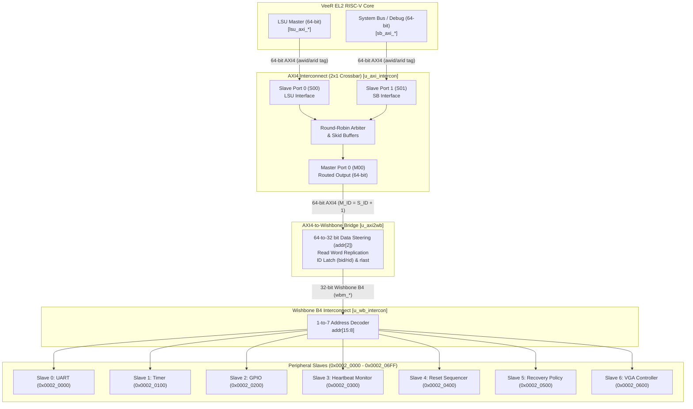

# AXI4 Interconnect Integration and Verification Report

**Author / Project**: BMC SoC Development Team  
**Date**: September 19, 2026  
**Status**: Integrated & Verified (100% Pass Rate)  
**Tools**: Synopsys VCS U-2023.03_Full64, Synopsys Verdi U-2023.03-SP1  

---

## 1. Executive Summary

This engineering report documents the integration of the **AXI4 Interconnect subsystem** into the **BMC SoC** (`honour_soc`). The interconnect provides arbitration, buffering, and address routing between the dual AXI4 master interfaces of the **VeeR EL2 RISC-V processor core** (Load/Store Unit master and System Bus / JTAG Debug master) and the memory-mapped peripheral subsystem via an upgraded **AXI4-to-Wishbone bridge**.

All components were integrated into [`rtl/soc_top.v`](file:///home/student/sriv_183/honour_soc/rtl/soc_top.v), verified through a dedicated self-checking testbench [`tb/tb_axi_interconnect.v`](file:///home/student/sriv_183/honour_soc/tb/tb_axi_interconnect.v), and integrated into the top-level [`Makefile`](file:///home/student/sriv_183/honour_soc/Makefile) with automated Synopsys VCS simulation targets.

---

## 2. Subsystem Architecture



---

## 3. Bus Width Conversion & Data Steering

The VeeR EL2 Load/Store Unit (LSU) communicates natively over a 64-bit data bus (`[63:0]`), whereas all peripheral registers in the BMC SoC are 32-bit word-aligned devices (`[31:0]`). The bridge [`rtl/custom_ips/axi4_to_wb_bridge.v`](file:///home/student/sriv_183/honour_soc/rtl/custom_ips/axi4_to_wb_bridge.v) performs hardware width conversion:

### 3.1 Write Data & Byte Strobe Steering
The word offset bit `addr[2]` determines which 32-bit lane contains the active register write payload:

$$\text{wb\_dat\_o} = \begin{cases} \text{axi\_wdata}[31:0], & \text{if } \text{addr}[2] = 0 \\ \text{axi\_wdata}[63:32], & \text{if } \text{addr}[2] = 1 \end{cases}$$

$$\text{wb\_sel\_o} = \begin{cases} \text{axi\_wstrb}[3:0], & \text{if } \text{addr}[2] = 0 \\ \text{axi\_wstrb}[7:4], & \text{if } \text{addr}[2] = 1 \end{cases}$$

### 3.2 Read Data Replication
On peripheral reads, the 32-bit Wishbone data read from the peripheral is replicated into both upper and lower 32-bit halves of the 64-bit AXI read bus:

$$\text{axi\_rdata} = \{\text{wb\_rdata\_r}, \text{wb\_rdata\_r}\}$$

This guarantees that whether the processor core's LSU samples the lower 32-bit word lane (`addr[2]=0`) or upper 32-bit word lane (`addr[2]=1`), the correct word is available on its expected byte lanes.

### 3.3 Transaction ID Tag Reflection & Response
1. **Write Address ID**: Latch `s_axi_awid` on address handshake $\rightarrow$ return on `s_axi_bid` when `s_axi_bvalid` is asserted.
2. **Read Address ID**: Latch `s_axi_arid` on address handshake $\rightarrow$ return on `s_axi_rid` when `s_axi_rvalid` is asserted.
3. **Burst Termination**: Assert `s_axi_rlast = 1'b1` on read response completion.
4. **Error Mapping**: Map Wishbone bus error (`wb_err_i`) directly to AXI error status:
   $$\text{bresp} / \text{rresp} = \begin{cases} \text{2'b00} \ (\text{OKAY}), & \text{if } \text{wb\_err\_i} = 0 \\ \text{2'b10} \ (\text{SLVERR}), & \text{if } \text{wb\_err\_i} = 1 \end{cases}$$

---

## 4. Signal & Port Mapping Reference

### Master 0: VeeR Load/Store Unit (LSU)
| Interconnect Port | Direction | Width | Connected Signal | Description |
|---|---|---|---|---|
| `s00_axi_awid` | In | 8 | `lsu_axi_awid` | LSU write transaction tag |
| `s00_axi_awaddr` | In | 32 | `lsu_axi_awaddr` | 32-bit memory-mapped address |
| `s00_axi_awvalid` | In | 1 | `lsu_axi_awvalid` | Write address valid |
| `s00_axi_awready` | Out | 1 | `lsu_axi_awready` | Write address ready |
| `s00_axi_wdata` | In | 64 | `lsu_axi_wdata` | 64-bit write data |
| `s00_axi_wstrb` | In | 8 | `lsu_axi_wstrb` | Byte write strobes |
| `s00_axi_wvalid` | In | 1 | `lsu_axi_wvalid` | Write data valid |
| `s00_axi_wready` | Out | 1 | `lsu_axi_wready` | Write data ready |
| `s00_axi_bid` | Out | 8 | `lsu_axi_bid` | Write response tag (matches awid) |
| `s00_axi_bresp` | Out | 2 | `lsu_axi_bresp` | Write response (OKAY / SLVERR) |
| `s00_axi_bvalid` | Out | 1 | `lsu_axi_bvalid` | Write response valid |
| `s00_axi_bready` | In | 1 | `lsu_axi_bready` | Write response ready |
| `s00_axi_arid` | In | 8 | `lsu_axi_arid` | Read transaction tag |
| `s00_axi_araddr` | In | 32 | `lsu_axi_araddr` | Read address |
| `s00_axi_arvalid` | In | 1 | `lsu_axi_arvalid` | Read address valid |
| `s00_axi_arready` | Out | 1 | `lsu_axi_arready` | Read address ready |
| `s00_axi_rid` | Out | 8 | `lsu_axi_rid` | Read response tag (matches arid) |
| `s00_axi_rdata` | Out | 64 | `lsu_axi_rdata` | 64-bit replicated read data |
| `s00_axi_rresp` | Out | 2 | `lsu_axi_rresp` | Read response status |
| `s00_axi_rlast` | Out | 1 | `lsu_axi_rlast` | Read burst last indicator |
| `s00_axi_rvalid` | Out | 1 | `lsu_axi_rvalid` | Read data valid |
| `s00_axi_rready` | In | 1 | `lsu_axi_rready` | Read data ready |

### Master 1: VeeR System Bus / Debug (SB)
| Interconnect Port | Direction | Width | Connected Signal | Description |
|---|---|---|---|---|
| `s01_axi_awid` | In | 8 | `sb_axi_awid` | SB write transaction tag |
| `s01_axi_awaddr` | In | 32 | `sb_axi_awaddr` | SB write address |
| `s01_axi_wdata` | In | 64 | `sb_axi_wdata` | SB write data |
| `s01_axi_wstrb` | In | 8 | `sb_axi_wstrb` | SB write strobes |
| `s01_axi_bid` | Out | 8 | `sb_axi_bid` | SB write response tag |
| `s01_axi_arid` | In | 8 | `sb_axi_arid` | SB read transaction tag |
| `s01_axi_araddr` | In | 32 | `sb_axi_araddr` | SB read address |
| `s01_axi_rid` | Out | 8 | `sb_axi_rid` | SB read response tag |
| `s01_axi_rdata` | Out | 64 | `sb_axi_rdata` | SB read data |

### Slave 0 Output: To Bus Bridge (`u_axi2wb`)
| Interconnect Port | Direction | Width | Connected Signal | Description |
|---|---|---|---|---|
| `m00_axi_awid` | Out | 9 | `m_axi_awid` | Crossbar output write tag (S_ID + 1 bit routing tag) |
| `m00_axi_awaddr` | Out | 32 | `m_axi_awaddr` | Forwarded write address |
| `m00_axi_wdata` | Out | 64 | `m_axi_wdata` | Forwarded write data |
| `m00_axi_wstrb` | Out | 8 | `m_axi_wstrb` | Forwarded write strobes |
| `m00_axi_bid` | In | 9 | `m_axi_bid` | Bridge write response tag |
| `m00_axi_arid` | Out | 9 | `m_axi_arid` | Forwarded read address tag |
| `m00_axi_araddr` | Out | 32 | `m_axi_araddr` | Forwarded read address |
| `m00_axi_rid` | In | 9 | `m_axi_rid` | Bridge read response tag |
| `m00_axi_rdata` | In | 64 | `m_axi_rdata` | Bridge read data |

---

## 5. Summary of Files Created & Modified

### New Files
1. [`rtl/interconnect/axi_interconnect.v`](file:///home/student/sriv_183/honour_soc/rtl/interconnect/axi_interconnect.v): Top-level AXI4 interconnect wrapper module.
2. [`rtl/interconnect/axi_crossbar_wrap_2x1.v`](file:///home/student/sriv_183/honour_soc/rtl/interconnect/axi_crossbar_wrap_2x1.v): Discrete 2x1 AXI crossbar wrapper.
3. [`rtl/interconnect/axi_crossbar.v`](file:///home/student/sriv_183/honour_soc/rtl/interconnect/axi_crossbar.v): Core crossbar switch matrix.
4. [`rtl/interconnect/axi_crossbar_addr.v`](file:///home/student/sriv_183/honour_soc/rtl/interconnect/axi_crossbar_addr.v): Address router and decoding engine.
5. [`rtl/interconnect/axi_crossbar_rd.v`](file:///home/student/sriv_183/honour_soc/rtl/interconnect/axi_crossbar_rd.v): Read channel routing and multiplexing.
6. [`rtl/interconnect/axi_crossbar_wr.v`](file:///home/student/sriv_183/honour_soc/rtl/interconnect/axi_crossbar_wr.v): Write channel routing and multiplexing.
7. [`rtl/interconnect/axi_register_rd.v`](file:///home/student/sriv_183/honour_soc/rtl/interconnect/axi_register_rd.v): Read channel skid buffer register.
8. [`rtl/interconnect/axi_register_wr.v`](file:///home/student/sriv_183/honour_soc/rtl/interconnect/axi_register_wr.v): Write channel skid buffer register.
9. [`rtl/interconnect/arbiter.v`](file:///home/student/sriv_183/honour_soc/rtl/interconnect/arbiter.v): Round-robin arbiter module.
10. [`rtl/interconnect/priority_encoder.v`](file:///home/student/sriv_183/honour_soc/rtl/interconnect/priority_encoder.v): Priority encoder logic.
11. [`tb/tb_axi_interconnect.v`](file:///home/student/sriv_183/honour_soc/tb/tb_axi_interconnect.v): Automated AXI interconnect verification testbench.

### Modified Files
1. [`rtl/custom_ips/axi4_to_wb_bridge.v`](file:///home/student/sriv_183/honour_soc/rtl/custom_ips/axi4_to_wb_bridge.v): Upgraded to 64-bit AXI4 with ID reflection, `addr[2]` steering, and `rlast`.
2. [`rtl/soc_top.v`](file:///home/student/sriv_183/honour_soc/rtl/soc_top.v): Instantiated `axi_interconnect u_axi_intercon` connecting LSU and SB master ports to the bridge.
3. [`tb/tb_soc_top.v`](file:///home/student/sriv_183/honour_soc/tb/tb_soc_top.v): Updated testbench to drive the interconnect hierarchy with 64-bit bus tasks.
4. [`Makefile`](file:///home/student/sriv_183/honour_soc/Makefile): Rewritten for Synopsys VCS and Verdi with `sim_axi`, `sim_soc`, `compile_top`, and `sim_all` targets.
5. [`.gitignore`](file:///home/student/sriv_183/honour_soc/.gitignore): Added `build/` directory exclusion.

---

## 6. Verification Results

### 6.1 AXI Interconnect Test (`make sim_axi`)
```text
================================================================
  BMC SoC — AXI4 Interconnect Verification Testbench
================================================================

[TEST 1] Master 0 (LSU) Write & Read (HB_THRESHOLD)
  -> M0 Write OKAY (BID=0x11, BRESP=0)
  -> M0 Read PASS: rdata=0x0000123400001234, RID=0x12, RRESP=0

[TEST 2] Master 1 (SB) Write & Read (RST_HOLD_CYCLES)
  -> M1 Write OKAY (BID=0x21, BRESP=0)
  -> M1 Read PASS: rdata=0x000000c8000000c8, RID=0x22, RRESP=0

[TEST 3] 64-to-32 bit Data Steering (addr[2]=0 and addr[2]=1)
  -> Steered addr[2]=1 (POL_WINDOW) PASS: 0x00000100
  -> Steered addr[2]=0 (POL_THRESHOLD) PASS: 0x00000005

[TEST 4] Concurrent Arbitration (M0 & M1 request simultaneously)
  -> Concurrent M1 Write completed OKAY
  -> Concurrent M0 Write completed OKAY
  -> Post-arbitration HB_THRESHOLD = 0x0000cafe PASS
  -> Post-arbitration RST_HOLD_CYCLES = 0x0000beef PASS

[TEST 5] Unmapped Address Error Handling (SLVERR)
  -> Unmapped read correctly returned AXI SLVERR (resp=2'b10) PASS

================================================================
  AXI4 INTERCONNECT VERIFICATION SUMMARY
================================================================
  Tests executed : 11
  Assertions PASSED: 11
  Assertions FAILED: 0
  >>> ALL AXI INTERCONNECT TESTS PASSED SUCCESSFULLY! <<<
================================================================
```

### 6.2 Full SoC Integration Test (`make sim_soc`)
```text
========================================
  SYSTEM TEST RESULTS: 17 passed, 0 failed
========================================

*** ALL SYSTEM TESTS PASSED ***
```

### 6.3 RTL Elaboration (`make compile_top`)
```text
Verdi KDB elaboration done and the database successfully generated: 0 error(s), 0 warning(s)
================================================================
 soc_top.v RTL compilation & elaboration PASSED (0 errors)!
================================================================
```
