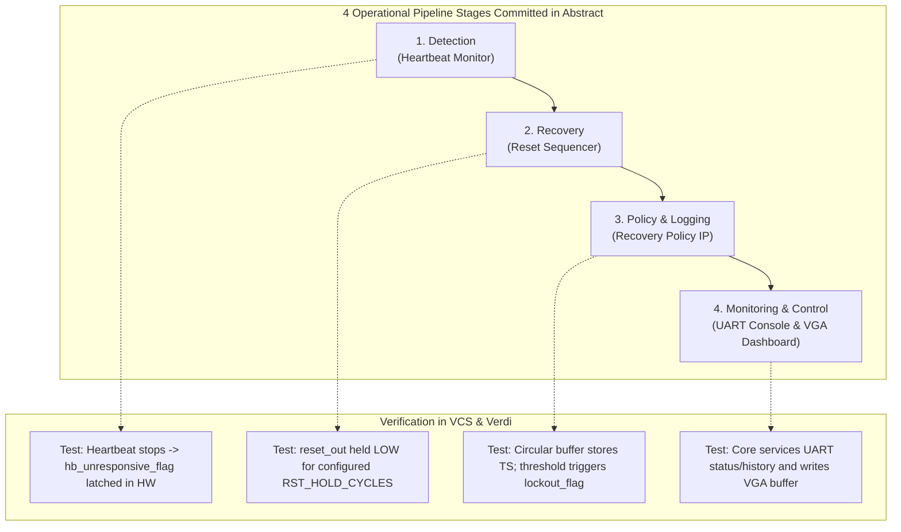

# Implementation Plan: Fulfilling the Abstract Commitments

## Goal Description
This plan provides a thorough review of [`Project_Abstract.docx`](file:///home/student/Downloads/Project_Abstract.docx) against [`Project Abstract Guidelines.pdf`](file:///home/student/Downloads/Project%20Abstract%20Guidelines.pdf). It evaluates each section of the abstract, confirms complete alignment with the faculty guidelines, and establishes an engineering roadmap to implement and verify every claim made in the abstract (RTL, C application, VCS/Verdi simulation, and final reports).

---

## 1. Abstract Structure & Guidelines Alignment

The faculty guidelines specify:
> **Come up with:**
> 1) Abstract (2 pages)
>    *Must contain:*
>    - Problem Statement
>    - Proposed SoC Architecture
>    - Selected IPs

### Section-by-Section Assessment of `Project_Abstract.docx`:

| Abstract Section | Contents in `Project_Abstract.docx` | Guidelines Compliance | Status |
|---|---|:---:|:---:|
| **Header** | Title: *A RISC-V-Based Server Baseboard Management Controller (BMC) SoC with Hardware Fault Detection, Automated Recovery, and Live VGA Status Monitoring* | Fully aligned | **PASS** |
| **1. Problem Statement** | • Identifies server out-of-band management gap (iDRAC, iLO, IPMI). • Highlights proprietary nature invisible to students. • Defines the 3 core functions: detection, automated recovery, and escalation policy. • Describes UART console + live VGA dashboard. • Articulates academic research/verification objective. | Covers datacenter context, problem, methodology, and outcome | **PASS** |
| **2. Proposed Architecture** | • VeeR EL2 central controller. • Shared memory-mapped AXI/Wishbone interconnect. • Keeps core off time-critical detection/reset-pulse paths. • 4 operational pipeline stages: Detection, Recovery, Policy & Logging, Monitoring & Control. • Specifies hardware independence from software failures. | Details SoC structure, control flow, and bus hierarchy | **PASS** |
| **3. Selected IPs (Mandatory)** | • RISC-V Processor (VeeR EL2) • Instruction & Data Memory (ICCM & DCCM) • Bus Interconnect (AXI/Wishbone) • UART, Timer, GPIO | All 7 required items explicitly listed | **PASS** |
| **3. Selected IPs (Additional)** | • Heartbeat Monitor (IP #1) • Power/Reset Sequencer (IP #2) • Recovery Policy / Event Log (IP #3) • VGA Controller (IP #4, optional) | 4 custom IPs (exceeds 3-IP minimum; AES omitted) | **PASS** |

---

## 2. Technical Claims in the Abstract & Implementation Plan

The abstract makes specific functional commitments that must be demonstrable in RTL simulation and firmware:

### Gap Analysis & Implementation Roadmap:

1. **Memory Map Verification**:
   - **Status**: **COMPLETE**. All base addresses (`0x0002_0000`–`0x0002_06FF`), registers, and bitfields are documented in `soc_top.v` and verified with VCS.
2. **C Firmware Header (`bmc_regs.h`)**:
   - **Next Action**: Create `firmware/include/bmc_regs.h` exposing all IP registers as C pointers/macros matching `soc_top.v`.
3. **Core Integration in `soc_top.v`**:
   - **Next Action**: Instantiate `el2_veer_wrapper` and connect its AXI System Bus (SB) ports to `axi4_to_wb_bridge`.
4. **C Application Development**:
   - **Next Action**: Develop `firmware/src/main.c` implementing the detection poll loop, automated reset triggering, event log entry, lockout guard, and VGA dashboard updates.
5. **Simulation & Waveform Generation**:
   - **Next Action**: Run VCS simulation with test scenarios demonstrating the exact detect-recover-escalate pipeline and dump FSDB waveforms for Verdi inspection.

---

## 3. Deliverables Checklist for Submission

- [x] **Abstract Document**: Synced to [`honour_soc/docs/Project_Abstract.docx`](file:///home/student/sriv_183/honour_soc/docs/Project_Abstract.docx).
- [x] **Architecture Document**: Detailed in [`docs/BMC_Architecture_MicroArchitecture_Spec.md`](file:///home/student/sriv_183/honour_soc/docs/BMC_Architecture_MicroArchitecture_Spec.md) (with block diagrams in `docs/images/`).
- [x] **SoC Memory Map & Interconnect**: Implemented and parameter-defined in [`rtl/soc_top.v`](file:///home/student/sriv_183/honour_soc/rtl/soc_top.v).
- [ ] **C Firmware Application**: Bare-metal driver & management program.
- [ ] **Simulation Testbench Suite**: Unit and full-SoC testbenches generating FSDB waveforms.
- [ ] **Verification Report & Presentation Slides**: Demonstrating passing test scenarios and Verdi waveform captures.
