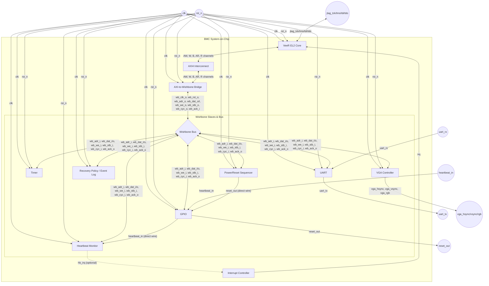
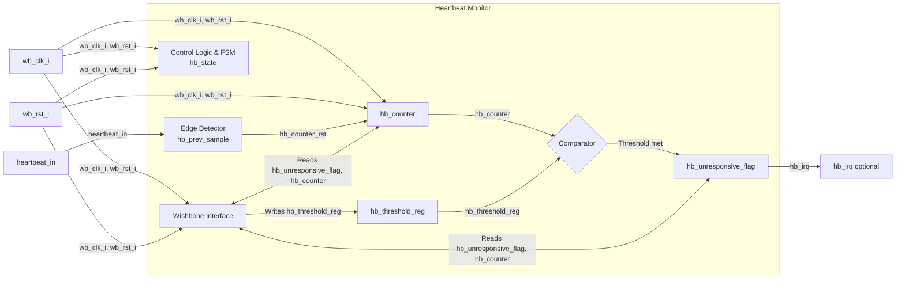
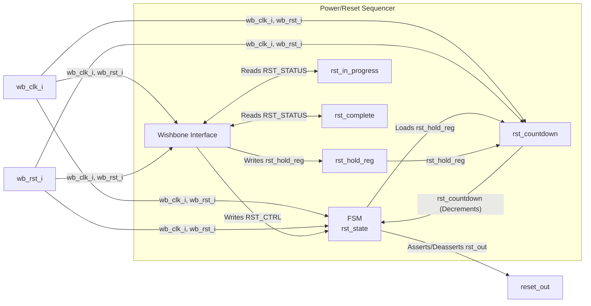
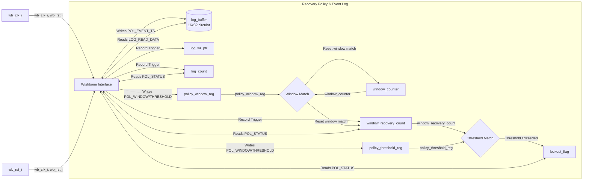
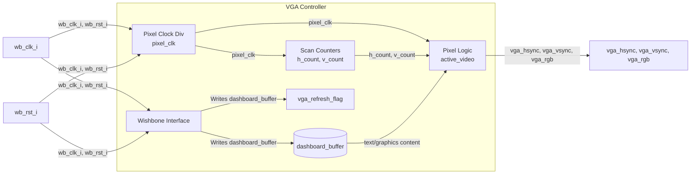

# Architecture, Specification & Micro-Architecture Document
## RISC-V-Based Server BMC SoC with Hardware Fault Detection, Automated Recovery, and Live VGA Status Monitoring

---

## 1. Introduction of the Project

Modern server hardware relies on a small, independent controller — a Baseboard Management Controller (BMC), commercially implemented as Dell iDRAC, HP iLO, or the open IPMI standard — to monitor system health and recover a frozen or unresponsive machine without requiring a human to be physically present. This out-of-band management capability is foundational to modern datacenter reliability, yet its internal hardware/software design is proprietary and effectively invisible to students.

This project implements a simplified BMC as a RISC-V System-on-Chip, built around the provided **VeeR EL2** processor core. The system performs three core functions in hardware:

1. **Detection** — continuously monitors a periodic heartbeat signal from a simulated "main system" and declares it unresponsive if the signal stops, using a hardware-timed mechanism independent of software.
2. **Recovery** — automatically triggers a controlled, precisely-timed reset sequence to attempt to bring the unresponsive system back.
3. **Policy & Escalation** — tracks how frequently recoveries occur; if the system is crash-looping (repeated failures within a short window), the design locks out further automatic recovery and escalates to a state requiring human intervention, rather than restarting indefinitely.

All system state is exposed through a UART-based remote management console and, optionally, a live VGA status dashboard, mirroring how real BMC hardware is both monitored and operated.

The processor's role is strictly limited to configuration, policy decisions, and servicing the management interface — it never itself performs time-critical detection or holds reset timing, which are implemented as dedicated hardware blocks. This separation is the central design principle of the system: the parts of the design responsible for judging and recovering from a failure must not be vulnerable to the same class of failure they are meant to catch.

**Project scope:**
- Mandatory infrastructure: VeeR EL2 core, instruction/data memory, bus interconnect, UART, Timer, GPIO — integrated from the provided reference SoC, not designed from scratch.
- Custom-designed IPs: Heartbeat Monitor, Power/Reset Sequencer, Recovery Policy/Event Log — the project's primary hardware design contribution.
- Optional fourth IP: VGA Controller, adapted from an existing base core, providing live visual monitoring.

---

## 2. Block Diagrams

This section provides the visual representations of the SoC architecture, dividing the system into the top-level interconnection and the detailed internal architecture of each custom IP.

### 2.1 Top-Level SoC Architecture

The top-level diagram illustrates the VeeR EL2 core, the AXI interconnect, the AXI-to-Wishbone bridge, the standard peripherals, and the custom IP blocks, along with external and internal signal routing.



### 2.2 Custom IPs Internal Architecture

#### 2.2.1 Heartbeat Monitor



#### 2.2.2 Power/Reset Sequencer



#### 2.2.3 Recovery Policy / Event Log



#### 2.2.4 VGA Controller (Optional)



---

## 3. Signal List

This section defines every signal in the design, grouped by scope: external (chip/testbench boundary), core-to-interconnect, inter-IP boundary signals (Wishbone), and internal signals within each custom IP.

### 3.1 External Signals (Chip/Testbench Boundary)

These are the signals that cross from the SoC into the simulated external world (the testbench, standing in for real physical connections).

| Signal | Direction (SoC perspective) | Width | Description |
|---|---|---|---|
| `clk` | in | 1 | System clock |
| `rst_n` | in | 1 | Active-low asynchronous system reset |
| `heartbeat_in` | in | 1 | Heartbeat pulse from simulated "main system," via GPIO pin |
| `reset_out` | out | 1 | Active-low reset command to simulated "main system," via GPIO pin |
| `uart_tx` | out | 1 | UART transmit line (to console/terminal) |
| `uart_rx` | in | 1 | UART receive line (from console/terminal) |
| `vga_hsync` | out | 1 | VGA horizontal sync (optional 4th IP) |
| `vga_vsync` | out | 1 | VGA vertical sync (optional 4th IP) |
| `vga_rgb` | out | 12 (or per base core) | VGA pixel color output (optional 4th IP) |
| `jtag_tck/tms/tdi/tdo` | in/in/in/out | 1 each | Debug Module Interface (provided by VeeR core, unmodified) |

### 3.2 Core ↔ Interconnect Signals (AXI4, core-provided, unmodified)

These are native VeeR EL2 AXI4 master signals connecting to the interconnect. Listed for completeness; not modified as part of this project's design work.

| Signal Group | Signals | Description |
|---|---|---|
| Write Address Channel | `AWADDR`, `AWLEN`, `AWSIZE`, `AWBURST`, `AWVALID`, `AWREADY` | Write transaction address/control |
| Write Data Channel | `WDATA`, `WSTRB`, `WLAST`, `WVALID`, `WREADY` | Write data payload |
| Write Response Channel | `BRESP`, `BVALID`, `BREADY` | Write completion status |
| Read Address Channel | `ARADDR`, `ARLEN`, `ARSIZE`, `ARBURST`, `ARVALID`, `ARREADY` | Read transaction address/control |
| Read Data Channel | `RDATA`, `RRESP`, `RLAST`, `RVALID`, `RREADY` | Read data payload |

### 3.3 AXI-to-Wishbone Bridge Boundary Signals

| Signal | Direction (bridge perspective) | Width | Description |
|---|---|---|---|
| (AXI4 slave side) | — | — | Mirrors signals in 3.2, slave role |
| `wb_clk_o` | out | 1 | Wishbone clock (typically = `clk`) |
| `wb_rst_o` | out | 1 | Wishbone reset (derived from `rst_n`) |
| `wb_adr_o` | out | 32 | Translated Wishbone address |
| `wb_dat_o` | out | 32 | Write data to Wishbone bus |
| `wb_dat_i` | in | 32 | Read data from Wishbone bus |
| `wb_we_o` | out | 1 | Write enable |
| `wb_stb_o` | out | 1 | Strobe |
| `wb_cyc_o` | out | 1 | Cycle valid |
| `wb_ack_i` | in | 1 | Acknowledge from addressed Wishbone slave |

### 3.4 Wishbone Peripheral Bus — Shared Signal Set (Inter-IP Boundary)

Every mandatory peripheral and every custom IP presents this identical Wishbone slave interface. This is the primary inter-IP boundary signal set for the project.

| Signal | Direction (IP perspective) | Width | Description |
|---|---|---|---|
| `wb_clk_i` | in | 1 | Bus clock |
| `wb_rst_i` | in | 1 | Synchronous reset |
| `wb_adr_i` | in | 8 (local offset) | Register address within this IP |
| `wb_dat_i` | in | 32 | Write data |
| `wb_dat_o` | out | 32 | Read data |
| `wb_we_i` | in | 1 | Write enable |
| `wb_stb_i` | in | 1 | Strobe (valid transaction) |
| `wb_cyc_i` | in | 1 | Bus cycle in progress |
| `wb_ack_o` | out | 1 | Transaction acknowledge |
| `wb_sel_i` | in | 4 | Byte select (if byte-granular access supported) |

### 3.5 Point-to-Point Inter-IP Signals (Non-Bus)

Signals that connect two specific IPs directly, outside the shared Wishbone bus — these are the functional "wires" of the BMC logic itself.

| Signal | From → To | Width | Description |
|---|---|---|---|
| `heartbeat_in` | GPIO → Heartbeat Monitor | 1 | Raw heartbeat pulse, routed internally from GPIO input register to the monitor IP (may be routed via GPIO's memory-mapped input register read by firmware, or hard-wired directly — see Section 4 for the chosen approach) |
| `reset_out` | Power/Reset Sequencer → GPIO | 1 | Reset pulse, routed to GPIO output register/pin |
| `hb_irq` (optional) | Heartbeat Monitor → Core (via PIC/interrupt controller) | 1 | Optional interrupt line if polling is replaced with interrupt-driven detection |

Note: in the baseline design (Section 4), `heartbeat_in` and `reset_out` are treated as **hardware-direct signals** wired between the GPIO peripheral's pin-level ports and the custom IPs — not routed through firmware register reads/writes on every cycle — since the entire point of the Heartbeat Monitor is to observe the pulse in hardware, continuously, independent of firmware execution.

### 3.6 Internal Signals — Heartbeat Monitor

| Signal | Width | Description |
|---|---|---|
| `hb_counter` | 32 | Free-running cycle counter since last heartbeat edge |
| `hb_counter_rst` | 1 | Internal: pulses when rising edge detected on `heartbeat_in` |
| `hb_threshold_reg` | 32 | Latched copy of `HB_THRESHOLD` register |
| `hb_unresponsive_flag` | 1 | Sticky internal flag, mirrors `HB_STATUS.bit0` |
| `hb_state` | 2 | FSM state: `DISABLED / IDLE / COUNTING / UNRESPONSIVE` |
| `hb_prev_sample` | 1 | Previous-cycle sample of `heartbeat_in`, used for edge detection |

### 3.7 Internal Signals — Power/Reset Sequencer

| Signal | Width | Description |
|---|---|---|
| `rst_countdown` | 32 | Countdown counter during `ASSERT` state |
| `rst_hold_reg` | 32 | Latched copy of `RST_HOLD_CYCLES` |
| `rst_state` | 2 | FSM state: `IDLE / ASSERT / DEASSERT / DONE` |
| `rst_in_progress` | 1 | Internal flag, mirrors `RST_STATUS.bit0` |
| `rst_complete` | 1 | Internal flag, mirrors `RST_STATUS.bit1` |

### 3.8 Internal Signals — Recovery Policy / Event Log

| Signal | Width | Description |
|---|---|---|
| `log_buffer` | 16 × 32 | Circular buffer array storing event timestamps |
| `log_wr_ptr` | 4 | Write pointer into `log_buffer` (wraps at 16) |
| `log_count` | 32 | Total events logged (saturating) |
| `window_counter` | 32 | Cycles elapsed in current rolling window |
| `window_recovery_count` | 8 | Recoveries counted within current window |
| `lockout_flag` | 1 | Sticky internal flag, mirrors `POL_STATUS.bit0` |
| `policy_window_reg` | 32 | Latched copy of `POL_WINDOW` |
| `policy_threshold_reg` | 8 | Latched copy of `POL_THRESHOLD` |

### 3.9 Internal Signals — VGA Controller (optional 4th IP)

| Signal | Width | Description |
|---|---|---|
| `pixel_clk` | 1 | Divided pixel clock derived from `clk` |
| `h_count`, `v_count` | 10, 10 | Horizontal/vertical scan position counters |
| `active_video` | 1 | High during drawable region |
| `dashboard_buffer` | implementation-defined | Text/graphics buffer holding current status content, written by firmware |
| `vga_refresh_flag` | 1 | Set when firmware should refresh buffer content |

---

## 4. Control Path of the Project

The control path describes how decisions and commands flow through the system — who tells whom to do what, and in what sequence.

### 4.1 Control Path — Detection to Recovery (Automatic Path)

```
[Testbench] --heartbeat_in pulses--> [GPIO pin] --direct wire--> [Heartbeat Monitor]
                                                                        |
                                                          (hardware counts, compares
                                                           to HB_THRESHOLD every cycle)
                                                                        |
                                                          [hb_unresponsive_flag = 1]
                                                                        |
                                                    (VeeR EL2 core polls HB_STATUS
                                                     via Wishbone read, in main loop)
                                                                        |
                                                    core checks POL_STATUS.lockout_flag
                                                    (Recovery Policy) via Wishbone read
                                                                        |
                                        ┌───────────────────────────────┴───────────────────────────────┐
                                 lockout = 0                                                      lockout = 1
                                        |                                                                  |
                    core writes RST_CTRL.trigger=1                                     core takes no reset action;
                    (Wishbone write to Reset Sequencer)                                logs "lockout active" via UART
                                        |
                    [Power/Reset Sequencer FSM]: ASSERT -> DEASSERT -> DONE
                    drives reset_out low for RST_HOLD_CYCLES, then high
                                        |
                    reset_out --direct wire--> [GPIO pin] --> [Testbench: simulated main system]
                                        |
                    core reads RST_STATUS.complete via Wishbone (poll)
                                        |
                    core reads Timer (current cycle count) via Wishbone
                                        |
                    core writes POL_EVENT_TS then POL_CTRL.record_event=1
                    (Wishbone writes to Recovery Policy IP)
                                        |
                    [Recovery Policy IP]: stores timestamp in log_buffer,
                    increments window_recovery_count, evaluates threshold,
                    sets lockout_flag if exceeded
                                        |
                    core writes HB_CTRL.clear_flag=1 (Wishbone write)
                    (explicit acknowledge — heartbeat resuming alone does NOT clear it)
```

### 4.2 Control Path — Manual Override (UART-Initiated)

```
[External terminal] --uart_rx--> [UART peripheral] --Wishbone read (polled by core)--> [VeeR EL2 core]
                                                                                              |
                                                                        [console.c command parser]
                                                                                              |
                    ┌───────────────────┬──────────────────────┬─────────────────────────┐
              "status"              "history"              "force reset"           "clear lockout"
                    |                    |                        |                         |
        core reads HB_STATUS,      core reads LOG_COUNT      core writes            core writes
        HB_ELAPSED, POL_STATUS     then loops LOG_READ_IDX/  RST_CTRL.trigger=1     POL_CTRL.clear_
        via Wishbone reads          LOG_READ_DATA per entry   (same path as 4.1     lockout=1
                    |                    |                     from Reset Sequencer  (Wishbone write)
        core writes response        core writes each entry    onward)                    |
        via UART (Wishbone write    via UART                       |                core writes
        to UART TX register)                                 core also writes       confirmation via UART
                    |                    |                    POL_EVENT_TS/record_
        [UART peripheral]           [UART peripheral]         event as in 4.1
        --uart_tx--> [terminal]     --uart_tx--> [terminal]
```

### 4.3 Control Path — VGA Dashboard Refresh (optional 4th IP)

```
[VeeR EL2 core, main loop, every iteration or on Timer tick]
        |
core reads HB_STATUS, HB_ELAPSED, POL_STATUS, LOG_COUNT (+ recent LOG_READ_DATA entries)
via Wishbone reads from Heartbeat Monitor and Recovery Policy IPs
        |
core writes formatted status content into VGA Controller's dashboard_buffer
via Wishbone writes
        |
[VGA Controller]: pixel-logic layer reads dashboard_buffer continuously,
independent of core, to generate hsync/vsync/rgb output every pixel clock
        |
--> [Simulated display / SDL VGA viewer]
```

### 4.4 Control Path Summary Table

| Trigger | Initiator | Path | Result |
|---|---|---|---|
| Heartbeat timeout | Hardware (Heartbeat Monitor) | Monitor → Core (poll) → Reset Sequencer → Recovery Policy | Automatic recovery + log, or blocked if locked out |
| `force reset` command | Firmware (UART command) | Core → Reset Sequencer → Recovery Policy | Manual recovery, always executes regardless of heartbeat state |
| `clear lockout` command | Firmware (UART command) | Core → Recovery Policy | Lockout flag manually cleared |
| Dashboard refresh | Firmware (main loop) | Core → (Heartbeat Monitor + Recovery Policy reads) → VGA Controller (write) | Live visual update |

---

## 5. Data Path of the Project

The data path describes how actual data values — not control decisions — move through the system: what data exists, where it's produced, and where it's consumed.

### 5.1 Data Path — Heartbeat Timing Data

```
heartbeat_in (1-bit pulse, external)
        |
        v
[Heartbeat Monitor: hb_counter] — increments every clk cycle, resets on each pulse edge
        |
        ├──> HB_ELAPSED register (32-bit) ──Wishbone read──> Core ──> UART "status" output
        |                                                       └──> VGA dashboard_buffer
        |
        v
[Comparator vs. hb_threshold_reg]
        |
        v
hb_unresponsive_flag (1-bit) ──> HB_STATUS register ──Wishbone read──> Core (decision input)
```

### 5.2 Data Path — Timestamp Data

```
[Timer peripheral: free-running cycle counter] (32-bit)
        |
        Wishbone read
        v
[Core: local variable, current timestamp]
        |
        Wishbone write to POL_EVENT_TS
        v
[Recovery Policy IP: staged timestamp register]
        |
        (on POL_CTRL.record_event trigger)
        v
[log_buffer[log_wr_ptr]] (32-bit entry written)
        |
        log_wr_ptr increments, wraps at 16
        log_count increments (saturating)
```

### 5.3 Data Path — Event Log Readback Data

```
Core writes LOG_READ_IDX (Wishbone write, 4-bit effective index)
        |
        v
[Recovery Policy IP: log_buffer[LOG_READ_IDX]] (combinational or registered read mux)
        |
        v
LOG_READ_DATA register (32-bit) ──Wishbone read──> Core
        |
        ├──> formatted and sent via UART ("history" command output)
        └──> written into VGA dashboard_buffer (recent entries display)
```

### 5.4 Data Path — Recovery Count / Window Data

```
[Recovery Policy IP internal: window_counter] — increments every clk cycle
        |
        v
[Comparator vs. policy_window_reg] — on match, window_counter resets to 0,
                                       window_recovery_count resets to 0
        |
(on each recorded event, independent of window reset)
window_recovery_count increments
        |
        v
[Comparator vs. policy_threshold_reg]
        |
        v
lockout_flag (1-bit, sticky) ──> POL_STATUS.bit0 ──Wishbone read──> Core (decision input)
                                                        └──> UART/VGA display
window_recovery_count (8-bit) ──> POL_STATUS.bits[15:8] ──Wishbone read──> Core ──> UART/VGA display
```

### 5.5 Data Path — Reset Pulse Data

```
Core writes RST_HOLD_CYCLES (Wishbone write, 32-bit, typically set once at boot)
        |
        v
[Power/Reset Sequencer: rst_hold_reg] (latched)
        |
(on trigger)
        v
[rst_countdown] loaded from rst_hold_reg, decrements every clk cycle
        |
        v
reset_out (1-bit) driven low for duration of countdown, then high
        |
        v
GPIO pin ──external wire──> Testbench (simulated main system reset input)
```

### 5.6 Data Path — UART Command/Response Data

```
External terminal keystrokes ──> uart_rx (serial bitstream)
        |
        v
[UART peripheral: RX FIFO/shift register] — deserializes to 8-bit bytes
        |
        Wishbone read (polled by core)
        v
[Core: console.c line buffer] — accumulates bytes until newline
        |
        v
[console_handle_command()] — parses buffer, dispatches to appropriate driver reads
        |
        v
[Core: formats response string]
        |
        Wishbone write (byte-by-byte or via TX FIFO)
        v
[UART peripheral: TX FIFO/shift register] — serializes to bitstream
        |
        v
uart_tx ──> External terminal display
```

### 5.7 Data Path — VGA Pixel Data (optional 4th IP)

```
[Core: formatted status strings/values] (from 5.1, 5.3, 5.4 above)
        |
        Wishbone write
        v
[VGA Controller: dashboard_buffer] (text/graphics content, firmware-updated)
        |
        (continuously, independent of core, every pixel clock)
        v
[VGA Controller: pixel-logic] — reads dashboard_buffer + h_count/v_count position
        |
        v
rgb, hsync, vsync (per-pixel output)
        |
        v
External display / SDL VGA viewer
```

### 5.8 Data Path Summary Table

| Data | Produced By | Consumed By | Transport |
|---|---|---|---|
| Heartbeat elapsed time | Heartbeat Monitor (hardware counter) | Core, then UART/VGA | Wishbone read |
| Unresponsive flag | Heartbeat Monitor | Core (decision logic) | Wishbone read |
| Timestamp | Timer peripheral | Core → Recovery Policy IP | Wishbone read then write |
| Event log entries | Recovery Policy IP (written by core-supplied timestamp) | Core → UART/VGA | Wishbone read |
| Lockout flag / recovery count | Recovery Policy IP | Core (decision logic), UART/VGA | Wishbone read |
| Reset hold duration | Core (configuration) | Power/Reset Sequencer | Wishbone write |
| Reset pulse | Power/Reset Sequencer | GPIO → simulated main system | Direct wire |
| UART command text | External terminal | Core (parser) | Wishbone read (RX) |
| UART response text | Core | External terminal | Wishbone write (TX) |
| Dashboard content | Core (aggregated from above) | VGA Controller → display | Wishbone write |

---

## 6. Open Items

1. Block diagram (Section 2) to be added once IP boundaries above are reviewed and confirmed.
2. Confirm whether `heartbeat_in`/`reset_out` are wired as direct point-to-point signals (as assumed in Section 3.5) versus routed through GPIO's memory-mapped registers with firmware relay — direct wiring is recommended and assumed throughout this document, since it keeps detection/reset timing fully in hardware.
3. Finalize actual base addresses against the provided VeeR reference SoC memory map.
4. Confirm interrupt-driven vs. polled detection for `hb_irq` — this document assumes polling for simplicity; interrupt-driven is a possible enhancement if time permits.
