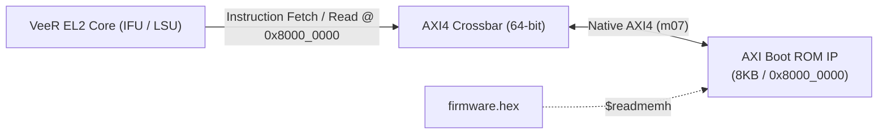
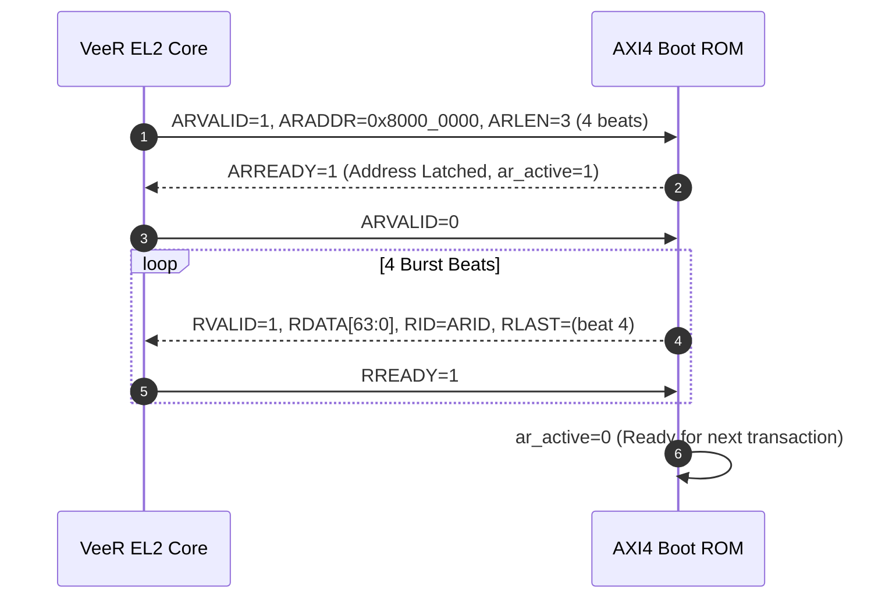

# Hardware IP Specification: AXI4 Boot ROM Controller

**Module Name:** `axi_rom`  
**Location:** `rtl/custom_ips/axi_rom.v`  
**SoC Base Address:** `0x8000_0000`  
**Bus Architecture:** 64-bit Native AXI4 Slave (Single-Beat and Incremental Burst Support)  
**Primary Function:** Non-Volatile Boot Code and Reset Vector Storage for VeeR EL2 Core  

---

## 1. Overview & System Purpose

The **AXI4 Boot ROM Controller IP** serves as the initial execution memory and primary boot store for the Baseboard Management Controller SoC. Upon release of system reset (`rst_n = 1`), the VeeR EL2 processor fetches its very first instruction from memory address `0x8000_0000`.

The AXI ROM IP features:
- **64-bit Native Read Data Bus:** Matches the VeeR Instruction Fetch Unit (IFU) and Load-Store Unit (LSU) 64-bit bus width.
- **AXI4 Burst Support:** Fully supports incremental read bursts (`INCR`), enabling cache-line fills and high-throughput instruction prefetching.
- **Safe Write Sink:** While the memory is non-volatile/read-only, write transactions (`AW`, `W`) complete gracefully with `bresp = OKAY` (`2'b00`) rather than creating bus faults or hanging the processor during rogue store instructions.
- **Hex Image Memory Initialization:** Initialized at simulation or FPGA bitstream synthesis from `firmware.hex` via `$readmemh`.



---

## 2. Hardware Interface & Signal Definitions

### Pinout Table (`axi_rom`)

| Signal Name | Direction | Width | Description |
|:---|:---:|:---:|:---|
| `clk` | Input | 1 | Master system clock (100 MHz) |
| `rst_n` | Input | 1 | Active-low global asynchronous reset |
| **AXI4 Read Address Channel (AR)** | | | |
| `s_axi_arid` | Input | 8 | Read transaction ID from Master |
| `s_axi_araddr` | Input | 32 | Byte read address (`0x8000_0000` to `0x8000_1FFF`) |
| `s_axi_arlen` | Input | 8 | Burst length (Number of transfers - 1) |
| `s_axi_arsize` | Input | 3 | Burst size (`3'b011` = 8 bytes / 64 bits) |
| `s_axi_arburst` | Input | 2 | Burst type (`2'b01` = INCR) |
| `s_axi_arvalid` | Input | 1 | Read address valid handshake |
| `s_axi_arready` | Output | 1 | Read address ready handshake |
| **AXI4 Read Data Channel (R)** | | | |
| `s_axi_rid` | Output | 8 | Read ID tag matching incoming `arid` |
| `s_axi_rdata` | Output | 64 | 64-bit instruction / data payload |
| `s_axi_rresp` | Output | 2 | Read response status (`2'b00` = OKAY) |
| `s_axi_rlast` | Output | 1 | Last read beat indicator (`r_count == arlen_q`) |
| `s_axi_rvalid` | Output | 1 | Read data valid handshake |
| `s_axi_rready` | Input | 1 | Master read data ready handshake |
| **AXI4 Write Channels (AW, W, B)** | | | |
| `s_axi_awid` / `s_axi_awaddr` | Input | 8/32 | Write address & transaction ID |
| `s_axi_awvalid` / `s_axi_awready` | In/Out | 1/1 | Write address handshake |
| `s_axi_wdata` / `s_axi_wstrb` | Input | 64/8 | Write payload |
| `s_axi_wvalid` / `s_axi_wready` | In/Out | 1/1 | Write data handshake |
| `s_axi_bid` / `s_axi_bresp` / `s_axi_bvalid` | Output | 8/2/1 | Write response handshake |
| `s_axi_bready` | Input | 1 | Master write response ready |

---

## 3. Memory Architecture & Burst Addressing

### 3.1 Parameterization

```verilog
parameter DATA_WIDTH = 64;
parameter ADDR_WIDTH = 32;
parameter ID_WIDTH   = 8;
parameter MEM_SIZE   = 8192; // 8KB Default
```

### 3.2 Burst Indexing & Endianness

The ROM byte storage array is declared as:
```verilog
reg [7:0] mem [0:MEM_SIZE-1];
```

For each beat of a read burst:
1. The byte address is updated according to the burst counter `r_count`:
   ```verilog
   wire [31:0] current_addr = araddr_q + (r_count * 8);
   ```
2. The base index is masked within the 8 KB memory boundary and aligned to an 8-byte boundary:
   ```verilog
   wire [31:0] base_idx = (current_addr & (MEM_SIZE - 1)) & ~32'd7;
   ```
3. 8 contiguous bytes are packed into the 64-bit data bus in Little-Endian byte order matching RISC-V conventions:
   ```verilog
   assign s_axi_rdata = {
       mem[base_idx+7], mem[base_idx+6], mem[base_idx+5], mem[base_idx+4],
       mem[base_idx+3], mem[base_idx+2], mem[base_idx+1], mem[base_idx+0]
   };
   ```

---

## 4. Theory of Operation

### 4.1 Read Handshake State Flow



1. **Address Phase:** When `s_axi_arvalid && s_axi_arready`, the ROM latches `arid`, `araddr`, and `arlen`, setting `ar_active = 1`.
2. **Data Streaming Phase:** `s_axi_rvalid` is asserted immediately. On every cycle where `s_axi_rvalid && s_axi_rready` fires, `r_count` increments.
3. **Termination:** When `r_count == arlen_q`, `s_axi_rlast` is asserted. Once the master accepts the final beat, `ar_active` resets to 0.

---

## 5. Verification & Integration Summary

- **Initialization Verification:** Verified through all firmware simulation targets (`sim_core`, `test_timer`, `test_gpio`, etc.) where the VeeR core successfully boots and executes firmware loaded from `firmware.hex`.
- **AXI4 Slave Integrity:** Verified in [`tb/tb_axi_interconnect.v`](file:///home/student/sriv_183/honour_soc/tb/tb_axi_interconnect.v) ensuring no deadlocks, proper ID reflections, and valid response handshakes.
