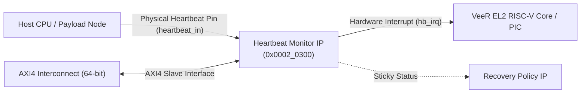
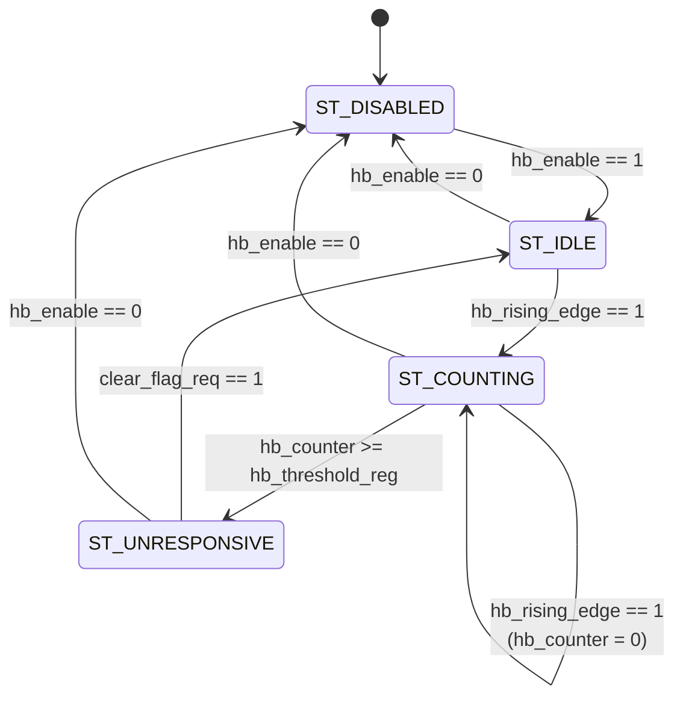

# Hardware IP Specification: Heartbeat Monitor (Watchdog)

**Module Names:** `heartbeat_monitor` (Core IP), `axi_heartbeat_monitor` (Native AXI4 Wrapper)  
**Location:** `rtl/custom_ips/heartbeat_monitor.v`, `rtl/custom_ips/axi_heartbeat_monitor.v`  
**SoC Base Address:** `0x0002_0300`  
**Bus Architecture:** 64-bit Native AXI4 Slave (32-bit Internal Register Interface)  
**Primary Function:** Host CPU / Server Board Watchdog & Liveness Supervisor  

---

## 1. Overview & System Purpose

In a modern server architecture, the **Baseboard Management Controller (BMC)** is responsible for supervising host processor health, thermal conditions, and boot integrity. The **Heartbeat Monitor IP** acts as a hardware watchdog timer and host liveness detector.

The host CPU or server node periodically toggles the physical `heartbeat_in` GPIO pin. The Heartbeat Monitor tracks this periodic ping:
- If the host toggles `heartbeat_in` within the programmed threshold duration, the system remains healthy.
- If the host hangs, crashes, encounters an unrecoverable kernel panic, or enters a deadlocked state, the `heartbeat_in` transitions cease.
- Upon timer expiration, the IP asserts the hardware interrupt `hb_irq`, latches the sticky `hb_unresponsive_flag`, and alerts the BMC processor core (VeeR EL2) to initiate automated recovery policies.



---

## 2. Hardware Interface & Signal Definitions

The IP is encapsulated in a two-tier architecture:
1. `heartbeat_monitor`: Core functional IP implementing the FSM, timers, and generic 32-bit register bus.
2. `axi_heartbeat_monitor`: Top-level wrapper bridging the 64-bit AXI4 crossbar to the core IP.

### Top-Level AXI4 Wrapper Pinout (`axi_heartbeat_monitor`)

| Signal Name | Direction | Width | Description |
|:---|:---:|:---:|:---|
| `clk` | Input | 1 | Master system clock (100 MHz in BMC SoC) |
| `rst_n` | Input | 1 | Global asynchronous active-low reset |
| **AXI4 Write Address (AW)** | | | |
| `s_axi_awid` | Input | 9 | AXI write transaction ID from Master |
| `s_axi_awaddr` | Input | 32 | AXI write byte address (Offset bits `[7:0]` decoded) |
| `s_axi_awlen` | Input | 8 | Burst length (single beat `8'h00` supported) |
| `s_axi_awsize` | Input | 3 | Burst size (`3'b010` = 4 bytes, `3'b011` = 8 bytes) |
| `s_axi_awburst` | Input | 2 | Burst type (`2'b01` = INCR) |
| `s_axi_awprot` | Input | 3 | Protection attributes (Privilege / Security level) |
| `s_axi_awvalid` | Input | 1 | Write address valid handshake |
| `s_axi_awready` | Output | 1 | Write address ready handshake |
| **AXI4 Write Data (W)** | | | |
| `s_axi_wdata` | Input | 64 | 64-bit write data bus |
| `s_axi_wstrb` | Input | 8 | Write byte enable strobes |
| `s_axi_wlast` | Input | 1 | Last transfer in write burst |
| `s_axi_wvalid` | Input | 1 | Write data valid handshake |
| `s_axi_wready` | Output | 1 | Write data ready handshake |
| **AXI4 Write Response (B)**| | | |
| `s_axi_bid` | Output | 9 | Latched write response transaction ID |
| `s_axi_bresp` | Output | 2 | Write response status (`2'b00` = OKAY) |
| `s_axi_bvalid` | Output | 1 | Write response valid handshake |
| `s_axi_bready` | Input | 1 | Master write response ready handshake |
| **AXI4 Read Address (AR)** | | | |
| `s_axi_arid` | Input | 9 | AXI read transaction ID from Master |
| `s_axi_araddr` | Input | 32 | AXI read byte address (Offset bits `[7:0]` decoded) |
| `s_axi_arlen` | Input | 8 | Read burst length |
| `s_axi_arsize` | Input | 3 | Read burst size |
| `s_axi_arburst` | Input | 2 | Read burst type |
| `s_axi_arprot` | Input | 3 | Protection attributes |
| `s_axi_arvalid` | Input | 1 | Read address valid handshake |
| `s_axi_arready` | Output | 1 | Read address ready handshake |
| **AXI4 Read Data (R)** | | | |
| `s_axi_rid` | Output | 9 | Read response transaction ID |
| `s_axi_rdata` | Output | 64 | 64-bit read data bus (32-bit register mirrored to both halves) |
| `s_axi_rresp` | Output | 2 | Read response status (`2'b00` = OKAY) |
| `s_axi_rlast` | Output | 1 | Read last beat flag (always 1 for single transfer) |
| `s_axi_rvalid` | Output | 1 | Read data valid handshake |
| `s_axi_rready` | Input | 1 | Master read data ready handshake |
| **Functional / Out-of-Band**| | | |
| `heartbeat_in` | Input | 1 | Physical heartbeat input pin from host server node |
| `hb_irq` | Output | 1 | Active-high level interrupt asserted when host is unresponsive |

---

## 3. Register Map & Bitfield Definitions

**Base Address:** `0x0002_0300`  
**Address Spacing:** 32-bit aligned words. Access size: 32 bits.

| Offset | Register Name | Access | Reset Value | Description |
|:---:|:---|:---:|:---:|:---|
| `0x00` | `HB_CTRL` | R/W | `0x0000_0000` | Control and Command Register |
| `0x04` | `HB_THRESHOLD`| R/W | `0x0000_0000` | Timeout Period in Clock Cycles |
| `0x08` | `HB_STATUS` | RO | `0x0000_0000` | Unresponsive Flag and Pin State |
| `0x0C` | `HB_ELAPSED` | RO | `0x0000_0000` | Elapsed Cycles Since Last Pulse |

---

### 3.1 `HB_CTRL` (Offset `0x00`) — Control & Command Register

| Bits | Field Name | Type | Reset | Description |
|:---:|:---|:---:|:---:|:---|
| `31:2` | `RESERVED` | RO | `30'd0` | Reserved. Reads return 0. |
| `1` | `CLEAR_FLAG` | WO | `1'b0` | **Self-clearing command bit.** Write `1` to clear `hb_unresponsive_flag` and reset the watchdog FSM back to `ST_IDLE`. Auto-clears in 1 clock cycle. |
| `0` | `HB_ENABLE` | R/W | `1'b0` | **Module Enable.**<br>`1` = Watchdog monitor enabled and active.<br>`0` = Module disabled. Resets counter to 0, clears unresponsive flag, and forces FSM to `ST_DISABLED`. |

*Note: Writing `0x03` to `HB_CTRL` simultaneously maintains enable (`bit 0 = 1`) and executes a watchdog pet / clear command (`bit 1 = 1`).*

---

### 3.2 `HB_THRESHOLD` (Offset `0x04`) — Watchdog Threshold Register

| Bits | Field Name | Type | Reset | Description |
|:---:|:---|:---:|:---:|:---|
| `31:0` | `THRESHOLD` | R/W | `32'd0` | Number of clock cycles without a rising edge on `heartbeat_in` before the host is declared unresponsive.<br>At 100 MHz clock rate, `1 ms = 100,000 cycles`. Setting `0` disables timeout triggering. |

---

### 3.3 `HB_STATUS` (Offset `0x08`) — Status Register

| Bits | Field Name | Type | Reset | Description |
|:---:|:---|:---:|:---:|:---|
| `31:2` | `RESERVED` | RO | `30'd0` | Reserved. Reads return 0. |
| `1` | `PIN_STATE` | RO | `1'b0` | **Current Raw Pin Level.** Reflects the immediate unsynchronized state of the physical `heartbeat_in` line. |
| `0` | `UNRESPONSIVE`| RO | `1'b0` | **Sticky Unresponsive Flag.**<br>`1` = Host timeout detected (`hb_counter >= HB_THRESHOLD`). Latches high until cleared via `HB_CTRL[1]` or module disable.<br>`0` = Host healthy or timeout cleared. |

---

### 3.4 `HB_ELAPSED` (Offset `0x0C`) — Elapsed Counter Register

| Bits | Field Name | Type | Reset | Description |
|:---:|:---|:---:|:---:|:---|
| `31:0` | `ELAPSED_CYCLES` | RO | `32'd0` | Current real-time value of internal watchdog counter (`hb_counter`). Increments every system clock tick. Cleared to 0 upon every rising edge on `heartbeat_in`. Saturates at `0xFFFF_FFFF`. |

---

## 4. Theory of Operation & Microarchitecture

### 4.1 Watchdog State Machine (FSM)

The core IP implements a four-state Moore finite state machine:



1. **`ST_DISABLED` (`2'b00`):**
   - Default state after hardware reset.
   - `hb_counter` is held at `0`.
   - `hb_unresponsive_flag` is forced to `0`.
   - Transitions to `ST_IDLE` when firmware sets `HB_CTRL[0] = 1`.

2. **`ST_IDLE` (`2'b01`):**
   - Monitor is armed and waiting for the first rising edge on `heartbeat_in`.
   - Prevents false watchdog timeouts during server boot before the host kernel initializes its heartbeat GPIO daemon.
   - Upon detecting a rising edge (`heartbeat_in & ~hb_prev_sample`), transitions to `ST_COUNTING`.

3. **`ST_COUNTING` (`2'b10`):**
   - Active supervision state.
   - `hb_counter` increments by 1 on every `clk` posedge.
   - If a valid `hb_rising_edge` occurs: `hb_counter <= 0`, restarting the countdown window.
   - If `hb_counter >= hb_threshold_reg`: The timer has expired. The IP sets `hb_unresponsive_flag <= 1'b1`, asserts `hb_irq`, and transitions to `ST_UNRESPONSIVE`.

4. **`ST_UNRESPONSIVE` (`2'b11`):**
   - Sticky fault condition.
   - `hb_unresponsive_flag` remains asserted, driving `hb_irq = 1` continuously.
   - Resuming pulse activity on `heartbeat_in` does **not** clear the condition (prevents flapping/intermittent faults from hiding crashes).
   - Can only exit if:
     - Firmware writes `1` to `HB_CTRL[1]` (`CLEAR_FLAG`), resetting state to `ST_IDLE`.
     - Firmware disables the IP (`HB_CTRL[0] = 0`), returning to `ST_DISABLED`.

---

### 4.2 64-to-32 Bit Data Steering & Bus Bridging

The BMC SoC interconnect uses a 64-bit wide AXI4 data bus, whereas peripheral registers are 32 bits wide:
- **Write Path:**
  ```verilog
  assign reg_wdata = s_axi_awaddr[2] ? s_axi_wdata[63:32] : s_axi_wdata[31:0];
  ```
  If `s_axi_awaddr[2] == 0` (offsets `0x00`, `0x08`), data is latched from lower 32 bits (`[31:0]`).  
  If `s_axi_awaddr[2] == 1` (offsets `0x04`, `0x0C`), data is latched from upper 32 bits (`[63:32]`).
- **Read Path:**
  ```verilog
  s_axi_rdata <= {reg_rdata, reg_rdata};
  ```
  The 32-bit register output `reg_rdata` is duplicated across both lower and upper halves of the 64-bit bus. The master CPU extracts the word corresponding to `araddr[2]`.

---

## 5. Firmware Programming Guide & Driver API

### 5.1 C Register Definitions

```c
#define HB_BASE         0x00020300
#define HB_CTRL         (*(volatile uint32_t*)(HB_BASE + 0x00))
#define HB_THRESHOLD    (*(volatile uint32_t*)(HB_BASE + 0x04))
#define HB_STATUS       (*(volatile uint32_t*)(HB_BASE + 0x08))
#define HB_ELAPSED      (*(volatile uint32_t*)(HB_BASE + 0x0C))

#define HB_CTRL_ENABLE      (1 << 0)
#define HB_CTRL_CLEAR_FLAG  (1 << 1)
#define HB_STATUS_UNRESP    (1 << 0)
#define HB_STATUS_PIN       (1 << 1)
```

### 5.2 Driver Initialization & Usage Workflow

```c
// 1. Initialize watchdog for 100 ms timeout at 100 MHz clock rate
void heartbeat_init(uint32_t timeout_cycles) {
    HB_CTRL = 0;                  // Disable module
    HB_THRESHOLD = timeout_cycles; // e.g., 10,000,000 for 100ms
    HB_CTRL = HB_CTRL_ENABLE;     // Enable into ST_IDLE
}

// 2. Periodic Service / Pet Watchdog
void heartbeat_pet(void) {
    // Keep enabled and pulse clear request
    HB_CTRL = (HB_CTRL_ENABLE | HB_CTRL_CLEAR_FLAG);
}

// 3. Interrupt Handler / Fault Recovery
void hb_irq_handler(void) {
    if (HB_STATUS & HB_STATUS_UNRESP) {
        // Log event to Recovery Policy IP
        POL_EVENT_TS = get_system_timestamp();
        POL_CTRL = 1; // Record failure event

        // Trigger system reset sequence
        RST_HOLD_CYCLES = 100;
        RST_CTRL = 1; // Trigger reset pulse

        // Acknowledge and clear heartbeat flag
        HB_CTRL = (HB_CTRL_ENABLE | HB_CTRL_CLEAR_FLAG);
    }
}
```

---

## 6. Verification & Test Coverage Summary

Verified via Synopsys VCS simulation using testbench [`tb/tb_heartbeat_monitor.v`](file:///home/student/sriv_183/honour_soc/tb/tb_heartbeat_monitor.v) (`make sim_hbm`) and VeeR core bare-metal firmware [`firmware/test/test_heartbeat.c`](file:///home/student/sriv_183/honour_soc/firmware/test/test_heartbeat.c) (`make test_heartbeat`).

| Test Scenario | Verification Target | Expected Behavior | Result |
|:---|:---|:---|:---:|
| **Happy Path** | Continuous pulses within window | `hb_unresponsive_flag == 0`, no IRQ | **PASSED** |
| **Timeout Detection** | Pulse withheld past `HB_THRESHOLD` | `hb_unresponsive_flag == 1`, `hb_irq == 1` | **PASSED** |
| **Sticky Latching** | Pulses resumed after timeout | Flag remains `1` until explicit clear command | **PASSED** |
| **Command Clear** | Writing `HB_CTRL[1] = 1` | Flag drops to `0`, state returns to `ST_IDLE` | **PASSED** |
| **Elapsed Counter** | Dynamic cycle check | `HB_ELAPSED` accurately counts elapsed system clocks | **PASSED** |
| **Disable / Reset** | Clearing `HB_CTRL[0]` | All registers reset, counter forced to 0 | **PASSED** |
