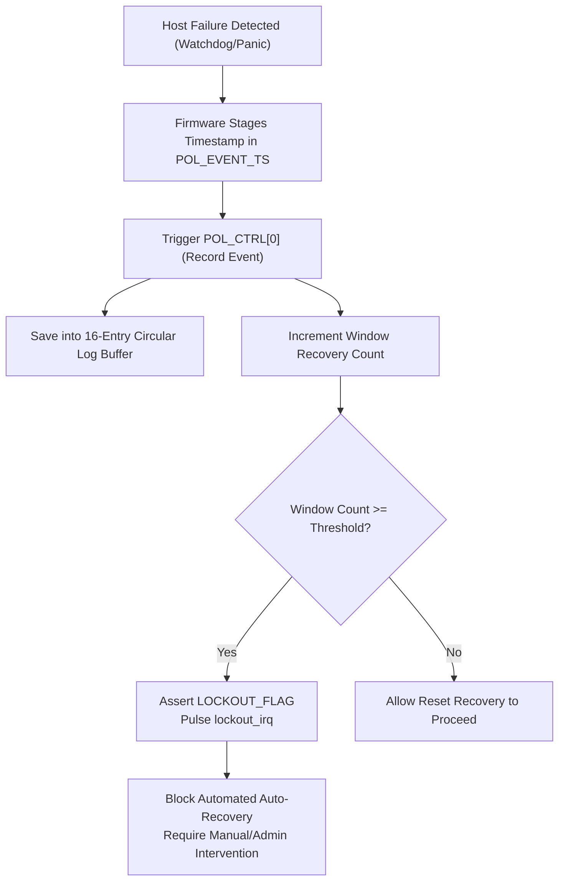
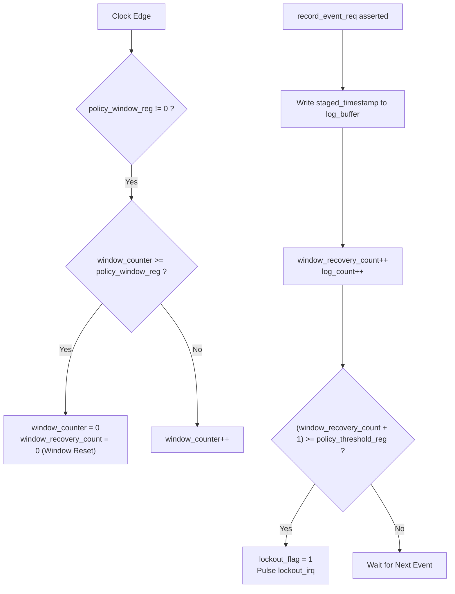

# Hardware IP Specification: Recovery Policy & Circular Event Log

**Module Names:** `recovery_policy` (Core IP), `axi_recovery_policy` (Native AXI4 Wrapper)  
**Location:** `rtl/custom_ips/recovery_policy.v`, `rtl/custom_ips/axi_recovery_policy.v`  
**SoC Base Address:** `0x0002_0500`  
**Bus Architecture:** 64-bit Native AXI4 Slave (32-bit Internal Register Interface)  
**Primary Function:** Automated Fault Escalation, Reset-Loop Mitigation (Lockout), and Forensic Event Logging  

---

## 1. Overview & System Purpose

When a server node freezes or encounters an uncorrectable crash, the BMC can automatically issue a hardware reset via the Reset Sequencer. However, if the underlying failure is caused by defective hardware (e.g. faulty DIMM, shorted VRM, damaged PCIe device), continuous automated resets create a catastrophic **"reboot storm"** or infinite reset loop.

The **Recovery Policy & Circular Event Log IP** solves this critical problem:
1. **Sliding-Window Failure Rate Limiting:** Enforces a configurable policy threshold (e.g. maximum 3 recovery events within a 200,000-cycle window).
2. **Hardware Lockout Protection:** If the failure rate exceeds the policy threshold, the IP enters a hardware **LOCKOUT** state and issues a high-priority interrupt (`lockout_irq`). Automated resets are halted until a technician or remote administrator explicitly clears the lockout.
3. **Forensic Circular Log Buffer:** Maintains a 16-entry circular memory log of 32-bit timestamps recording each fault occurrence for post-mortem diagnostics.



---

## 2. Hardware Interface & Signal Definitions

### Top-Level Pinout Table (`axi_recovery_policy`)

| Signal Name | Direction | Width | Description |
|:---|:---:|:---:|:---|
| `clk` | Input | 1 | Master system clock (100 MHz in BMC SoC) |
| `rst_n` | Input | 1 | Asynchronous active-low global reset |
| **AXI4 Write Interface** | | | |
| `s_axi_awid` | Input | 9 | Write transaction ID |
| `s_axi_awaddr` | Input | 32 | Write byte address (Bits `[7:0]` decoded) |
| `s_axi_awlen` / `awsize` / `awburst` | Input | 8/3/2 | Standard AXI4 burst configuration |
| `s_axi_awvalid` / `s_axi_awready` | In/Out | 1/1 | Write address handshake |
| `s_axi_wdata` | Input | 64 | 64-bit write data bus |
| `s_axi_wstrb` | Input | 8 | Write byte enable mask |
| `s_axi_wvalid` / `s_axi_wready` | In/Out | 1/1 | Write data handshake |
| `s_axi_bid` / `bresp` / `bvalid` / `bready` | Out/In | 9/2/1/1 | Write response channel |
| **AXI4 Read Interface** | | | |
| `s_axi_arid` | Input | 9 | Read transaction ID |
| `s_axi_araddr` | Input | 32 | Read byte address |
| `s_axi_arlen` / `arsize` / `arburst` | Input | 8/3/2 | Standard AXI4 read burst configuration |
| `s_axi_arvalid` / `s_axi_arready` | In/Out | 1/1 | Read address handshake |
| `s_axi_rid` / `rresp` / `rlast` / `rvalid` / `rready` | Out/In | 9/2/1/1/1 | Read data response channel |
| `s_axi_rdata` | Output | 64 | 64-bit read data bus (Mirrored 32-bit register output) |
| **Functional / Out-of-Band** | | | |
| `lockout_irq` | Output | 1 | **Single-Cycle Pulse Interrupt.** Asserted for 1 clock cycle upon the transition of `lockout_flag` from `0` to `1`. |

---

## 3. Register Map & Bitfield Definitions

**Base Address:** `0x0002_0500`  
**Address Spacing:** 32-bit aligned words. Access size: 32 bits.

| Offset | Register Name | Access | Reset Value | Description |
|:---:|:---|:---:|:---:|:---|
| `0x00` | `POL_CTRL` | WO | `0x0000_0000` | Control and Command Register (Self-clearing) |
| `0x04` | `POL_WINDOW` | R/W | `0x0000_0000` | Time Window in Cycles (0 = Disabled) |
| `0x08` | `POL_THRESHOLD` | R/W | `0x0000_0003` | Max Allowable Recoveries in Window (Default: 3) |
| `0x0C` | `POL_STATUS` | RO | `0x0000_0000` | Lockout State & Current Window Event Count |
| `0x10` | `POL_EVENT_TS` | WO | `0x0000_0000` | Staged Timestamp Input for Event Logging |
| `0x14` | `LOG_READ_IDX` | R/W | `0x0000_0000` | Index Selector for Log Buffer Readback (`[3:0]`) |
| `0x18` | `LOG_READ_DATA`| RO | `0x0000_0000` | Timestamp Data at Selected Log Index |
| `0x1C` | `LOG_COUNT` | RO | `0x0000_0000` | Lifetime Event Counter (Saturates at 0xFFFFFFFF) |

---

### 3.1 `POL_CTRL` (Offset `0x00`) — Policy Control Register

| Bits | Field Name | Type | Reset | Description |
|:---:|:---|:---:|:---:|:---|
| `31:2` | `RESERVED` | RO | `30'd0` | Reserved. |
| `1` | `CLEAR_LOCKOUT` | WO | `1'b0` | **Clear Lockout Command.** Writing `1` clears `lockout_flag`, resets `window_recovery_count` to 0, and resets the window timer. Self-clears in 1 cycle. |
| `0` | `RECORD_EVENT` | WO | `1'b0` | **Record Failure Event Command.** Writing `1` logs the value of `POL_EVENT_TS` into the circular buffer, advances write pointer, increments count, and checks threshold. Self-clears in 1 cycle. |

---

### 3.2 `POL_WINDOW` (Offset `0x04`) — Window Duration Register

| Bits | Field Name | Type | Reset | Description |
|:---:|:---|:---:|:---:|:---|
| `31:0` | `WINDOW_CYCLES` | R/W | `32'd0` | Time window duration in clock cycles.<br>When `window_counter >= POL_WINDOW`, `window_recovery_count` resets to 0.<br>Setting to `0` disables window expiration (all events accumulate until cleared). |

---

### 3.3 `POL_THRESHOLD` (Offset `0x08`) — Lockout Threshold Register

| Bits | Field Name | Type | Reset | Description |
|:---:|:---|:---:|:---:|:---|
| `31:8` | `RESERVED` | RO | `24'd0` | Reserved. |
| `7:0` | `THRESHOLD` | R/W | `8'd3` | Maximum allowed recovery events within `POL_WINDOW`. If `window_recovery_count >= THRESHOLD`, `lockout_flag` is set. |

---

### 3.4 `POL_STATUS` (Offset `0x0C`) — Status Register

| Bits | Field Name | Type | Reset | Description |
|:---:|:---|:---:|:---:|:---|
| `31:24`| `RESERVED` | RO | `8'd0` | Reserved. |
| `23:16`| `WINDOW_COUNT`| RO | `8'd0` | Number of events recorded in the current active time window. |
| `15:1` | `RESERVED` | RO | `15'd0` | Reserved. |
| `0` | `LOCKOUT_FLAG` | RO | `1'b0` | **Hardware Lockout Status.**<br>`1` = System in LOCKOUT state. Auto-recovery should be blocked.<br>`0` = System healthy / auto-recovery permitted. |

---

### 3.5 `LOG_READ_IDX` (Offset `0x14`) & `LOG_READ_DATA` (Offset `0x18`)

| Register | Bits | Type | Description |
|:---|:---:|:---:|:---|
| `LOG_READ_IDX` | `3:0` | R/W | Selects which of the 16 circular buffer slots to expose via `LOG_READ_DATA` (`0x0` to `0xF`). |
| `LOG_READ_DATA`| `31:0`| RO | Reads the 32-bit staged timestamp stored at entry `log_buffer[log_read_idx]`. |

---

### 3.6 `LOG_COUNT` (Offset `0x1C`) — Lifetime Log Counter

| Bits | Field Name | Type | Reset | Description |
|:---:|:---|:---:|:---:|:---|
| `31:0` | `TOTAL_EVENTS` | RO | `32'd0` | Lifetime count of all recorded failure events since boot/reset. Saturates at `0xFFFF_FFFF`. |

---

## 4. Theory of Operation & Microarchitecture

### 4.1 Circular Buffer Mechanism

The IP instantiates a 16-entry array of 32-bit registers:
```verilog
reg [31:0] log_buffer [0:15];
reg [3:0]  log_wr_ptr;
```
- When `POL_CTRL[0]` is written:
  1. `log_buffer[log_wr_ptr] <= staged_timestamp;`
  2. `log_wr_ptr <= log_wr_ptr + 1;` (automatically wraps from 15 to 0).
  3. `log_count <= log_count + 1;`
- The circular buffer always preserves the **16 most recent failure timestamps** in hardware.
- Firmware can read any entry arbitrarily by writing the entry index (`0`–`15`) into `LOG_READ_IDX` and reading `LOG_READ_DATA`.

---

### 4.2 Window Counter & Lockout Threshold Logic



- **Lockout Stickiness:** Once `lockout_flag` transitions to `1`, it remains latched indefinitely, even if the window counter expires. Only an explicit write to `POL_CTRL[1]` (`CLEAR_LOCKOUT`) can reset the flag.
- **Hardware Interrupt Pulse:** To avoid holding CPU interrupt lines high perpetually, `lockout_irq` is edge-detected and generates a clean 1-cycle high pulse upon lockout entry.

---

## 5. Software Programming Guide & Driver API

### 5.1 C Header Definitions

```c
#define POL_BASE          0x00020500
#define POL_CTRL          (*(volatile uint32_t*)(POL_BASE + 0x00))
#define POL_WINDOW        (*(volatile uint32_t*)(POL_BASE + 0x04))
#define POL_THRESHOLD     (*(volatile uint32_t*)(POL_BASE + 0x08))
#define POL_STATUS        (*(volatile uint32_t*)(POL_BASE + 0x0C))
#define POL_EVENT_TS      (*(volatile uint32_t*)(POL_BASE + 0x10))
#define LOG_READ_IDX      (*(volatile uint32_t*)(POL_BASE + 0x14))
#define LOG_READ_DATA     (*(volatile uint32_t*)(POL_BASE + 0x18))
#define LOG_COUNT         (*(volatile uint32_t*)(POL_BASE + 0x1C))

#define POL_CTRL_RECORD   (1 << 0)
#define POL_CTRL_CLEAR    (1 << 1)
#define POL_STATUS_LOCKOUT (1 << 0)
```

### 5.2 Fault Handling & Logging Sequence

```c
// Configure Recovery Policy during boot
void recovery_policy_init(uint32_t window_cycles, uint8_t max_failures) {
    POL_WINDOW = window_cycles;       // e.g., 200,000 cycles (~2 ms)
    POL_THRESHOLD = max_failures;     // e.g., 3 failures before lockout
    POL_CTRL = POL_CTRL_CLEAR;        // Clear any stale state
}

// Log a crash event and execute recovery if permitted
int handle_host_crash(uint32_t current_timestamp) {
    // 1. Stage timestamp and record event in hardware
    POL_EVENT_TS = current_timestamp;
    POL_CTRL = POL_CTRL_RECORD;
    delay(5); // Allow single-cycle latch

    // 2. Check if we entered hardware lockout
    if (POL_STATUS & POL_STATUS_LOCKOUT) {
        uart_print("CRITICAL: Recovery Lockout Threshold Exceeded! Halting resets.\n");
        // Display red warning on VGA dashboard
        vga_print(1, 0, "SYSTEM LOCKOUT: REBOOT LOOP DETECTED");
        return -1; // Abort reset
    }

    // 3. Lockout not triggered -> Safe to pulse reset
    trigger_host_reset(100);
    return 0;
}

// Dump circular log buffer for diagnostics
void dump_recovery_log(void) {
    uint32_t total = LOG_COUNT;
    int entries = (total > 16) ? 16 : total;
    uart_print("--- Recovery Event Log Buffer ---\n");
    for (int i = 0; i < entries; i++) {
        LOG_READ_IDX = i;
        uart_print("  Entry["); uart_print_dec(i); uart_print("]: ");
        uart_print_hex(LOG_READ_DATA);
        uart_print("\n");
    }
}
```

---

## 6. Verification & Test Coverage Summary

Verified via Synopsys VCS unit testbench [`tb/tb_recovery_policy.v`](file:///home/student/sriv_183/honour_soc/tb/tb_recovery_policy.v) (`make sim_pol`) and firmware test [`firmware/test/test_recovery_policy.c`](file:///home/student/sriv_183/honour_soc/firmware/test/test_recovery_policy.c) (`make test_recovery_policy`).

| Test Number | Test Scenario | Verified Criteria | Result |
|:---:|:---|:---|:---:|
| **1** | Single Event Recording | `LOG_COUNT == 1`, `LOG_READ_DATA[0]` matches staged value | **PASSED** |
| **2** | Multiple Events & Readback | Successive writes store correct timestamps at indices 0, 1 | **PASSED** |
| **3** | Threshold Lockout | Threshold = 3; 3rd event sets `LOCKOUT_FLAG = 1` and pulses IRQ | **PASSED** |
| **4** | Sticky Lockout | Lockout persists across additional clock cycles and idle time | **PASSED** |
| **5** | Clear Lockout Command | Writing `POL_CTRL[1] = 1` clears flag and resets window count | **PASSED** |
| **6** | Circular Buffer Wrap | 18 events written; buffer wraps and overwrites oldest slots 0, 1 | **PASSED** |
| **7** | Window Reset Clears Count | Window expiry resets `window_recovery_count` to 0 without lockout | **PASSED** |
| **8** | Rapid Burst Events | Rapid consecutive events immediately trigger lockout correctly | **PASSED** |
