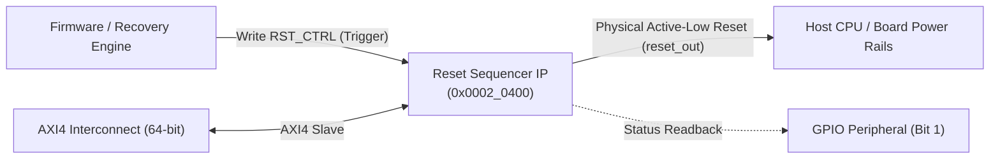
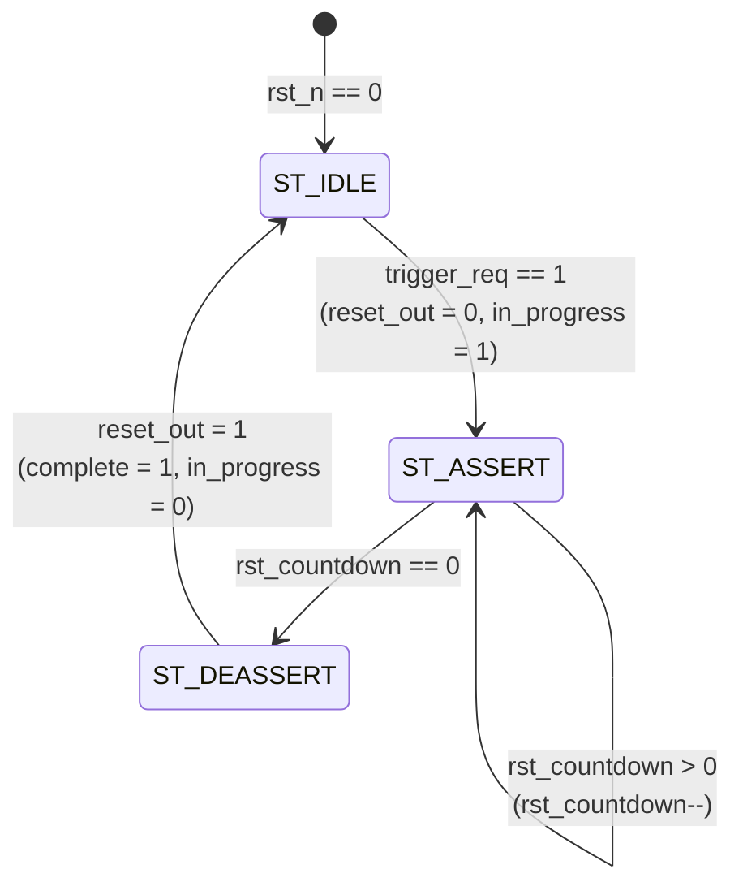

# Hardware IP Specification: Power/Reset Sequencer

**Module Names:** `reset_sequencer` (Core IP), `axi_reset_sequencer` (Native AXI4 Wrapper)  
**Location:** `rtl/custom_ips/reset_sequencer.v`, `rtl/custom_ips/axi_reset_sequencer.v`  
**SoC Base Address:** `0x0002_0400`  
**Bus Architecture:** 64-bit Native AXI4 Slave (32-bit Internal Register Interface)  
**Primary Function:** Controlled Power-on & Warm Reset Pulse Generation for Host/SoC Subsystems  

---

## 1. Overview & System Purpose

In server systems and high-reliability embedded platforms, generating an orderly, glitch-free, and timed hardware reset is vital. Asserting a reset line for too brief a duration may cause flip-flops or state machines to enter indeterminate metastable states; conversely, prolonged resets can impact server availability.

The **Power/Reset Sequencer IP** provides the BMC firmware with deterministic, cycle-accurate control over the physical `reset_out` line (active-low). It guarantees:
- Minimum programmable reset hold durations (default 100 clock cycles = 1 µs at 100 MHz).
- Non-reentrant and glitch-free reset pulses.
- Real-time status reporting (`in_progress` and `complete` indicators).
- Interconnection with hardware watchdogs and recovery policy engines to orchestrate automated server power-cycling.



---

## 2. Hardware Interface & Signal Definitions

The module is partitioned into a core sequencer module (`reset_sequencer`) and an AXI4 protocol wrapper (`axi_reset_sequencer`).

### Top-Level Pinout Table (`axi_reset_sequencer`)

| Signal Name | Direction | Width | Description |
|:---|:---:|:---:|:---|
| `clk` | Input | 1 | Primary system clock (100 MHz in BMC SoC) |
| `rst_n` | Input | 1 | Global asynchronous active-low reset |
| **AXI4 Write Channels (AW, W, B)** | | | |
| `s_axi_awid` | Input | 9 | AXI write transaction ID |
| `s_axi_awaddr` | Input | 32 | AXI write byte address (Lower bits `[7:0]` decoded) |
| `s_axi_awlen` | Input | 8 | Burst length |
| `s_axi_awsize` | Input | 3 | Burst size |
| `s_axi_awburst` | Input | 2 | Burst type |
| `s_axi_awprot` | Input | 3 | Protection attributes |
| `s_axi_awvalid` | Input | 1 | Write address valid handshake |
| `s_axi_awready` | Output | 1 | Write address ready handshake |
| `s_axi_wdata` | Input | 64 | 64-bit write data bus |
| `s_axi_wstrb` | Input | 8 | Write byte enable strobes |
| `s_axi_wlast` | Input | 1 | Last beat of write burst |
| `s_axi_wvalid` | Input | 1 | Write data valid handshake |
| `s_axi_wready` | Output | 1 | Write data ready handshake |
| `s_axi_bid` | Output | 9 | Buffered write response ID |
| `s_axi_bresp` | Output | 2 | Write response status (`2'b00` = OKAY) |
| `s_axi_bvalid` | Output | 1 | Write response valid handshake |
| `s_axi_bready` | Input | 1 | Master response ready handshake |
| **AXI4 Read Channels (AR, R)** | | | |
| `s_axi_arid` | Input | 9 | AXI read transaction ID |
| `s_axi_araddr` | Input | 32 | AXI read byte address |
| `s_axi_arlen` | Input | 8 | Read burst length |
| `s_axi_arsize` | Input | 3 | Read burst size |
| `s_axi_arburst` | Input | 2 | Read burst type |
| `s_axi_arprot` | Input | 3 | Protection attributes |
| `s_axi_arvalid` | Input | 1 | Read address valid handshake |
| `s_axi_arready` | Output | 1 | Read address ready handshake |
| `s_axi_rid` | Output | 9 | Read response ID |
| `s_axi_rdata` | Output | 64 | 64-bit read data bus (Mirrored 32-bit register output) |
| `s_axi_rresp` | Output | 2 | Read response status (`2'b00` = OKAY) |
| `s_axi_rlast` | Output | 1 | Last read beat indicator |
| `s_axi_rvalid` | Output | 1 | Read data valid handshake |
| `s_axi_rready` | Input | 1 | Master read ready handshake |
| **Functional / Out-of-Band** | | | |
| `reset_out` | Output | 1 | **Physical Reset Output.** Active-low output signal routed to host board reset pins. |

---

## 3. Register Map & Bitfield Definitions

**Base Address:** `0x0002_0400`  
**Address Spacing:** 32-bit word aligned. Register width: 32 bits.

| Offset | Register Name | Access | Reset Value | Description |
|:---:|:---|:---:|:---:|:---|
| `0x00` | `RST_CTRL` | WO | `0x0000_0000` | Trigger Reset Sequence Command |
| `0x04` | `RST_HOLD_CYCLES` | R/W | `0x0000_0064` | Configurable Reset Hold Duration (Default: 100) |
| `0x08` | `RST_STATUS` | RO | `0x0000_0000` | Reset Sequencer Operational Status |

---

### 3.1 `RST_CTRL` (Offset `0x00`) — Trigger Control Register

| Bits | Field Name | Type | Reset | Description |
|:---:|:---|:---:|:---:|:---|
| `31:1` | `RESERVED` | RO | `31'd0` | Reserved. Reads return 0. |
| `0` | `TRIGGER` | WO | `1'b0` | **Trigger Command.** Write `1` to initiate a reset sequence.<br>Self-clears back to 0 in hardware after 1 clock cycle.<br>Ignored if a sequence is already in progress (`RST_STATUS[0] == 1`). |

---

### 3.2 `RST_HOLD_CYCLES` (Offset `0x04`) — Hold Duration Register

| Bits | Field Name | Type | Reset | Description |
|:---:|:---|:---:|:---:|:---|
| `31:0` | `HOLD_CYCLES` | R/W | `32'd100` (`0x64`) | Duration in system clock cycles for which `reset_out` is held active (LOW).<br>At 100 MHz: `100 cycles = 1.0 µs`. Setting to `100,000` yields a `1.0 ms` hold time. |

---

### 3.3 `RST_STATUS` (Offset `0x08`) — Status Register

| Bits | Field Name | Type | Reset | Description |
|:---:|:---|:---:|:---:|:---|
| `31:2` | `RESERVED` | RO | `30'd0` | Reserved. Reads return 0. |
| `1` | `COMPLETE` | RO | `1'b0` | **Sequence Complete Flag.**<br>`1` = A reset sequence has completed successfully.<br>`0` = Reset sequence has not yet run or has been restarted. |
| `0` | `IN_PROGRESS`| RO | `1'b0` | **Sequencer Busy Status.**<br>`1` = Reset sequence is active (`reset_out` is currently held LOW).<br>`0` = Sequencer is idle (`reset_out` is HIGH). |

---

## 4. Theory of Operation & Microarchitecture

### 4.1 State Machine Architecture

The reset generation logic is governed by a deterministic, non-reentrant 3-state finite state machine:



1. **`ST_IDLE` (`2'b00`):**
   - Normal operating state.
   - `reset_out` is deasserted (`1'b1`).
   - `in_progress` is `0`.
   - When a write to `RST_CTRL` arrives with bit 0 set (`trigger_req = 1`), the FSM immediately transitions to `ST_ASSERT`.
   - The countdown register `rst_countdown` is loaded with `rst_hold_cycles_reg`.

2. **`ST_ASSERT` (`2'b01`):**
   - Active reset state.
   - `reset_out` is driven LOW (`1'b0`).
   - `in_progress` is asserted (`1'b1`), and `complete` is cleared (`1'b0`).
   - On every clock cycle, `rst_countdown` decrements by 1.
   - Any further trigger commands arriving while in this state are safely ignored (preventing truncation or race conditions).
   - When `rst_countdown == 0`, the FSM transitions to `ST_DEASSERT`.

3. **`ST_DEASSERT` (`2'b10`):**
   - Single-cycle cleanup state.
   - `reset_out` is driven HIGH (`1'b1`).
   - `in_progress` falls to `0`.
   - `complete` is latched to `1`.
   - Unconditionally transitions back to `ST_IDLE` on the next posedge of `clk`.

---

### 4.2 Waveform & Timing Specification

```
                  ┌──┐  ┌──┐  ┌──┐  ┌──┐  ┌──┐  ┌──┐  ┌──┐  ┌──┐  ┌──┐  ┌──┐
clk            ───┘  └──┘  └──┘  └──┘  └──┘  └──┘  └──┘  └──┘  └──┘  └──┘  └──
                  ──────┐
trigger_req             └─────────────────────────────────────────────────────
                         ┌─────────────────────────────────┐
rst_state      ── IDLE ──┤             ASSERT              │ DEASSERT ── IDLE 
                         └─────────────────────────────────┘
               ─────────┐                                   ┌─────────────────
reset_out               └───────────────────────────────────┘
                         <──────── rst_hold_cycles ────────>
                         ┌─────────────────────────────────┐
in_progress    ──────────┘                                 └──────────────────
                                                            ┌─────────────────
complete       ─────────────────────────────────────────────┘
```

---

## 5. Software Programming Guide & Driver API

### 5.1 C Header Definitions

```c
#define RST_BASE            0x00020400
#define RST_CTRL            (*(volatile uint32_t*)(RST_BASE + 0x00))
#define RST_HOLD_CYCLES     (*(volatile uint32_t*)(RST_BASE + 0x04))
#define RST_STATUS          (*(volatile uint32_t*)(RST_BASE + 0x08))

#define RST_STATUS_IN_PROGRESS (1 << 0)
#define RST_STATUS_COMPLETE    (1 << 1)
```

### 5.2 Driver Functions & Usage Examples

```c
// Configure reset hold width and trigger pulse
void trigger_host_reset(uint32_t hold_cycles) {
    // 1. Check if sequencer is currently busy
    if (RST_STATUS & RST_STATUS_IN_PROGRESS) {
        return; // Busy, do not interrupt ongoing cycle
    }

    // 2. Set desired hold duration (e.g., 5000 cycles = 50 µs at 100MHz)
    RST_HOLD_CYCLES = hold_cycles;

    // 3. Trigger pulse
    RST_CTRL = 1;

    // 4. Optionally poll for completion (blocking)
    while (!(RST_STATUS & RST_STATUS_COMPLETE)) {
        __asm__ volatile("nop");
    }
}
```

---

## 6. Verification & Test Coverage Summary

Verified via Synopsys VCS standalone testbench [`tb/tb_reset_sequencer.v`](file:///home/student/sriv_183/honour_soc/tb/tb_reset_sequencer.v) (`make sim_rst`) and firmware test [`firmware/test/test_reset_sequencer.c`](file:///home/student/sriv_183/honour_soc/firmware/test/test_reset_sequencer.c) (`make test_reset_sequencer`).

| Test Number | Test Scenario | Verified Criteria | Result |
|:---:|:---|:---|:---:|
| **1** | Power-on Reset Value | `reset_out == 1`, `RST_HOLD_CYCLES == 100` | **PASSED** |
| **2** | Basic Pulse Generation | `reset_out` goes LOW for exactly 50 cycles | **PASSED** |
| **3** | Status Flags Operation | `in_progress == 1` during sequence, `complete == 1` after | **PASSED** |
| **4** | Re-trigger While Busy | New trigger while busy is ignored; hold duration unmodified | **PASSED** |
| **5** | Variable Hold Durations | Tested with 10, 45, 100, and 250 cycles; cycle accuracy verified | **PASSED** |
| **6** | Back-to-Back Sequential | Consecutive triggers execute reliably without deadlock | **PASSED** |
