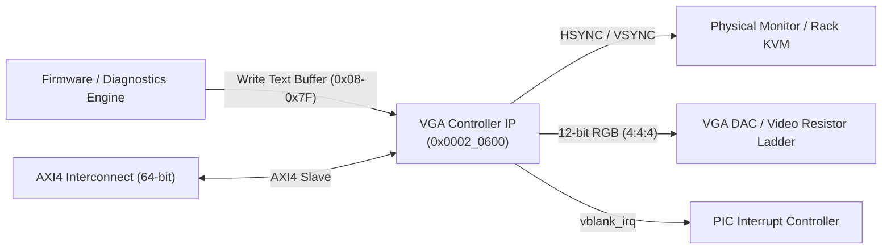

# Hardware IP Specification: VGA Controller & Status Dashboard

**Module Names:** `vga_controller` (Core IP), `axi_vga_controller` (Native AXI4 Wrapper)  
**Location:** `rtl/custom_ips/vga_controller.v`, `rtl/custom_ips/axi_vga_controller.v`  
**SoC Base Address:** `0x0002_0600`  
**Bus Architecture:** 64-bit Native AXI4 Slave (32-bit Internal Register Interface)  
**Primary Function:** Local Display Engine & Out-of-Band Server Status Dashboard (640×480 @ 60 Hz)  

---

## 1. Overview & System Purpose

In datacenter operations, when a server node experiences network stack failure, PCIe bus lockup, or total OS crash, remote IPMI / KVM over IP may become unreachable. The **VGA Controller & Status Dashboard IP** provides an independent, out-of-band hardware display pipeline that drives local crash and health telemetry directly to a physical monitor or rack crash-cart.

The IP features:
- Industry-standard **640×480 @ 60 Hz** video timing generated directly from the 100 MHz SoC system clock.
- An internal **120-character ASCII text buffer** organized as 3 lines × 40 columns.
- Dedicated hardware character rasterizer with terminal color palette (matrix green font on deep blue background).
- Hardware **Vertical Blanking Interrupt (`vblank_irq`)** enabling tear-free screen updates.
- Real-time refresh synchronization flag (`VGA_STATUS[0]`).



---

## 2. Hardware Interface & Signal Definitions

### Top-Level Pinout Table (`axi_vga_controller`)

| Signal Name | Direction | Width | Description |
|:---|:---:|:---:|:---|
| `clk` | Input | 1 | Master SoC clock (100 MHz) |
| `rst_n` | Input | 1 | Active-low global asynchronous reset |
| **AXI4 Write Channels (AW, W, B)** | | | |
| `s_axi_awid` / `s_axi_awaddr` | Input | 9/32 | Write ID & byte address |
| `s_axi_awlen` / `awsize` / `awburst` | Input | 8/3/2 | Standard AXI4 burst configuration |
| `s_axi_awvalid` / `s_axi_awready` | In/Out | 1/1 | Write address handshake |
| `s_axi_wdata` | Input | 64 | 64-bit write data |
| `s_axi_wstrb` | Input | 8 | Write byte enables |
| `s_axi_wvalid` / `s_axi_wready` | In/Out | 1/1 | Write data handshake |
| `s_axi_bid` / `bresp` / `bvalid` / `bready` | Out/In | 9/2/1/1 | Write response channel |
| **AXI4 Read Channels (AR, R)** | | | |
| `s_axi_arid` / `s_axi_araddr` | Input | 9/32 | Read ID & byte address |
| `s_axi_arlen` / `arsize` / `arburst` | Input | 8/3/2 | Standard AXI4 read burst configuration |
| `s_axi_arvalid` / `s_axi_arready` | In/Out | 1/1 | Read address handshake |
| `s_axi_rid` / `rresp` / `rlast` / `rvalid` / `rready` | Out/In | 9/2/1/1/1 | Read response channel |
| `s_axi_rdata` | Output | 64 | 64-bit read data bus (Mirrored 32-bit word) |
| **Physical Video Interface (VGA)** | | | |
| `vga_hsync` | Output | 1 | Horizontal Synchronization (Active LOW during sync pulse) |
| `vga_vsync` | Output | 1 | Vertical Synchronization (Active LOW during sync pulse) |
| `vga_rgb` | Output | 12 | 12-bit Digital RGB: `[11:8]` Red, `[7:4]` Green, `[3:0]` Blue |
| `vblank_irq` | Output | 1 | Single-cycle pulse interrupt asserted at beginning of VBLANK |

---

## 3. Register Map & Memory Organization

**Base Address:** `0x0002_0600`  
**Address Range:** `0x0002_0600` – `0x0002_067F` (128 bytes decoded)

| Offset | Register Name | Access | Reset Value | Description |
|:---:|:---|:---:|:---:|:---|
| `0x00` | `VGA_CTRL` | R/W | `0x0000_0000` | Display Enable / Disable Control |
| `0x04` | `VGA_STATUS` | RO | `0x0000_0000` | Frame Synchronization & Refresh Status |
| `0x08` – `0x7F` | `VGA_TEXT_BUFFER`| R/W | `0x2020_2020` | 30 Words (120 ASCII Chars), Big-Endian Packed |

---

### 3.1 `VGA_CTRL` (Offset `0x00`) — Video Control Register

| Bits | Field Name | Type | Reset | Description |
|:---:|:---|:---:|:---:|:---|
| `31:1` | `RESERVED` | RO | `31'd0` | Reserved. |
| `0` | `ENABLE` | R/W | `1'b0` | **Display Enable.**<br>`1` = Video output active. RGB signals driven according to scan coordinates.<br>`0` = Video output disabled. RGB forced to black (`12'h000`); HSYNC and VSYNC continue toggling to maintain monitor sync lock. |

---

### 3.2 `VGA_STATUS` (Offset `0x04`) — Status Register

| Bits | Field Name | Type | Reset | Description |
|:---:|:---|:---:|:---:|:---|
| `31:1` | `RESERVED` | RO | `31'd0` | Reserved. |
| `0` | `REFRESH_FLAG` | RO | `1'b0` | **Buffer Modified Flag.** Set to `1` in hardware whenever any word in `VGA_TEXT_BUFFER` is written. Automatically reset to `0` at start of frame (`h_count == 0 && v_count == 0`), confirming the change has been scanned out. |

---

### 3.3 `VGA_TEXT_BUFFER` (Offsets `0x08` – `0x7F`) — Dashboard Memory

The text buffer consists of **30 words (120 bytes)**.
- Each 32-bit memory location stores **4 ASCII characters** in **Big-Endian format** (character with lowest display index is in the most significant byte `[31:24]`).
- Screen Layout: **3 lines × 40 columns** (120 characters total).
- Reset State: Initialized to ASCII spaces (`0x20202020`).

#### Character Packing Diagram (32-bit Word)

```
 Bits:   31           24 23           16 15            8 7             0
        ┌───────────────┬───────────────┬───────────────┬───────────────┐
 Word:  │  Char N + 0   │  Char N + 1   │  Char N + 2   │  Char N + 3   │
        └───────────────┴───────────────┴───────────────┴───────────────┘
```

#### Memory Layout Mapping

| Byte Offset | Word Index | Characters Displayed | Screen Position |
|:---:|:---:|:---|:---|
| `0x08` | Word 0 | Chars 0–3 | Line 0, Cols 0–3 |
| `0x0C` | Word 1 | Chars 4–7 | Line 0, Cols 4–7 |
| ... | ... | ... | ... |
| `0x2C` | Word 9 | Chars 36–39 | Line 0, Cols 36–39 |
| `0x30` | Word 10 | Chars 40–43 | Line 1, Cols 0–3 |
| ... | ... | ... | ... |
| `0x54` | Word 19 | Chars 76–79 | Line 1, Cols 36–39 |
| `0x58` | Word 20 | Chars 80–83 | Line 2, Cols 0–3 |
| ... | ... | ... | ... |
| `0x7C` | Word 29 | Chars 116–119 | Line 2, Cols 36–39 |

---

## 4. Theory of Operation & Microarchitecture

### 4.1 VGA Timing Generator (640×480 @ 60 Hz)

Industry-standard VGA uses a **25.175 MHz** pixel clock. In this SoC, the 100 MHz master clock is divided by 4 via a 2-bit counter:
```verilog
always @(posedge clk) begin
    if (!rst_n) pixel_clk_div <= 2'd0;
    else        pixel_clk_div <= pixel_clk_div + 2'd1;
end
assign pixel_clk_en = (pixel_clk_div == 2'd0); // 25.0 MHz pixel rate
```

The scan counters increment upon each `pixel_clk_en`:

| Timing Parameter | Horizontal (Pixels) | Vertical (Lines) |
|:---|:---:|:---:|
| **Active Video** | 640 | 480 |
| **Front Porch** | 16 | 10 |
| **Sync Pulse (Active LOW)** | 96 | 2 |
| **Back Porch** | 48 | 33 |
| **Total Period** | **800** | **525** |
| **Refresh Rate** | 31.25 kHz line rate | 59.52 Hz frame rate |

Sync signals are generated using active-low pulse comparators:
```verilog
vga_hsync <= ~((h_count >= 656) && (h_count < 752));
vga_vsync <= ~((v_count >= 490) && (v_count < 492));
```

---

### 4.2 Character Rendering & Color Generation

- **Grid Sizing:** Each character cell is **8×8 pixels**.
- **Character Coordinates:**
  - `char_col = h_count / 8 = h_count[9:3]` (Columns 0 to 79 across 640 horizontal pixels).
  - `char_row = v_count / 8 = v_count[9:3]` (Rows 0 to 59 across 480 vertical pixels).
- **Text Dashboard Window:** The top 3 rows (`char_row < 3`) and left 40 columns (`char_col < 40`) form the active 120-character telemetry dashboard.
- **Font Rasterizer:** Printable characters (`ascii_char != 0x20 && ascii_char != 0x00`) illuminate pixels within a 6×6 interior block (leaving a 1-pixel border for legibility).
- **Color Outputs:**
  - **Foreground Text:** High-intensity Matrix Green (`12'h0F0` -> R=0, G=15, B=0).
  - **Background Area:** Dark Blue (`12'h001` -> R=0, G=0, B=1).
  - **Blanking / Disabled:** Pitch Black (`12'h000`).

---

## 5. Software Programming Guide & Driver API

### 5.1 C Header Definitions

```c
#define VGA_BASE        0x00020600
#define VGA_CTRL        (*(volatile uint32_t*)(VGA_BASE + 0x00))
#define VGA_STATUS      (*(volatile uint32_t*)(VGA_BASE + 0x04))
#define VGA_TEXT_BUFFER ((volatile uint32_t*)(VGA_BASE + 0x08))

#define VGA_ENABLE      (1 << 0)
#define VGA_REFRESH     (1 << 0)
```

### 5.2 Formatted Dashboard String Writer

```c
// Write text string into the 3x40 dashboard grid
void vga_print(int row, int col, const char* str) {
    if (row < 0 || row >= 3 || col < 0 || col >= 40) return;
    
    int char_idx = (row * 40) + col;
    while (*str && char_idx < 120) {
        int word_idx = char_idx / 4;
        int byte_pos = 3 - (char_idx % 4); // Big-Endian byte selection
        
        uint32_t word = VGA_TEXT_BUFFER[word_idx];
        uint32_t mask = ~(0xFF << (byte_pos * 8));
        word = (word & mask) | (((uint32_t)(uint8_t)*str) << (byte_pos * 8));
        VGA_TEXT_BUFFER[word_idx] = word;
        
        str++;
        char_idx++;
    }
}

// Display BMC System Health Dashboard on local monitor
void update_vga_dashboard(uint32_t uptime_sec, int host_online, int lockout) {
    VGA_CTRL = VGA_ENABLE; // Ensure display engine is active
    
    // Row 0: Header Banner
    vga_print(0, 0, "=== BMC TELEMETRY DASHBOARD (100MHz) ===");
    
    // Row 1: Host State & Lockout Condition
    if (lockout) {
        vga_print(1, 0, "STATUS: [CRITICAL LOCKOUT] REBOOT STOPPED");
    } else if (host_online) {
        vga_print(1, 0, "STATUS: [HOST ONLINE - HEARTBEAT OKAY]   ");
    } else {
        vga_print(1, 0, "STATUS: [HOST UNRESPONSIVE - RECOVERING] ");
    }
    
    // Row 2: Diagnostics Summary
    vga_print(2, 0, "VGA: 640x480@60Hz | AXI4 NATIVE SLAVE 6");
}
```

---

## 6. Verification & Test Coverage Summary

Verified via Synopsys VCS simulation using testbench [`firmware/test/test_vga.c`](file:///home/student/sriv_183/honour_soc/firmware/test/test_vga.c) (`make test_vga`) and full SoC integration test [`tb/tb_soc_core.v`](file:///home/student/sriv_183/honour_soc/tb/tb_soc_core.v) (`make sim_core`).

| Test Number | Test Scenario | Verified Criteria | Result |
|:---:|:---|:---|:---:|
| **1** | Video Enable Control | Writing `1` enables display; bit 0 reads back 1 | **PASSED** |
| **2** | Video Disable Control | Writing `0` blanks RGB while HSYNC/VSYNC remain locked | **PASSED** |
| **3** | Status Readback | `VGA_STATUS` readable without AXI bus error or deadlock | **PASSED** |
| **4** | Buffer Memory Access | Full 120-character buffer written via AXI4 bus cycles | **PASSED** |
| **5** | Word Packing Verification | Direct 32-bit reads match Big-Endian ASCII encoding | **PASSED** |
| **6** | Timing Verification | 800-pixel line duration and 525-line frame verified in wave traces | **PASSED** |
