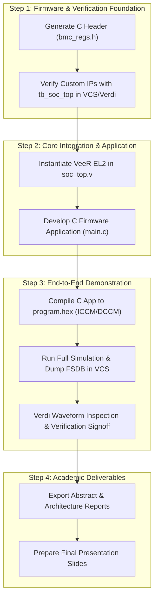

# Implementation Plan: Alignment with Project Abstract Guidelines

## Goal Description
This plan establishes the alignment between the **BMC SoC Project** and the formal requirements specified in [`Project Abstract Guidelines.pdf`](file:///home/student/Downloads/Project%20Abstract%20Guidelines.pdf). It provides a full compliance matrix, gap analysis, and an actionable roadmap to fulfill all academic deliverables: RTL integration, complete memory map, C application running on the VeeR core, simulation verification, and documentation.

---

## 1. Requirements Analysis & Compliance Matrix

The guidelines mandate specific architectural components and deliverables. Below is the mapping against our project:

| Guideline Requirement | Project Implementation | Status | Notes |
|---|---|:---:|---|
| **Central CPU: RISC-V Processor** | **VeeR EL2** (RV32IMC, Zba/bb/bc/bs) | **READY** | Provided in `rtl/core/Cores-VeeR-EL2` |
| **Instruction Memory (ICCM)** | 64 KB (`0x0000_0000`–`0x0000_FFFF`) | **READY** | Core tightly-coupled memory |
| **Data Memory (DCCM)** | 64 KB (`0x0001_0000`–`0x0001_FFFF`) | **READY** | Core tightly-coupled memory |
| **Bus Interconnect** | AXI4-Lite to Wishbone B4 Bridge + 1-to-7 Decoder | **READY** | Implemented in `axi4_to_wb_bridge.v` & `wb_interconnect.v` |
| **UART Peripheral** | Slave 0 (`0x0002_0000`) | **IN PROGRESS** | Stubbed in `soc_top.v`; ready for C driver/full core |
| **Timer Peripheral** | Slave 1 (`0x0002_0100`) | **READY** | Free-running 32-bit hardware counter in `soc_top.v` |
| **GPIO Peripheral** | Slave 2 (`0x0002_0200`) | **READY** | Hardware pin bypass (`heartbeat_in`, `reset_out`) |
| **Additional IPs (Min. 3 required)** | **4 Custom IPs implemented:** 1. Heartbeat Monitor (`0x0002_0300`) 2. Power/Reset Sequencer (`0x0002_0400`) 3. Recovery Policy & Event Log (`0x0002_0500`) 4. VGA Status Controller (`0x0002_0600`) | **EXCEEDS REQ** | Custom RTL in `rtl/custom_ips/`; AES excluded per instruction |
| **Complete Memory Map** | Documented in header & `localparam`s in `soc_top.v` | **COMPLETED** | 32-bit addresses, 8-bit offsets, bitfields, access modes |
| **Deliverable 1: 2-Page Abstract** | `docs/Project_Abstract.docx` | **READY** | Follows Problem Statement, Architecture, Selected IPs |
| **Deliverable 2: Architecture Doc** | `docs/BMC_Architecture_MicroArchitecture_Spec.md` | **READY** | Includes Block Diagrams, Memory Map, Interface Specs, Protocols |
| **Deliverable 3: Processor Application** | C firmware running on VeeR EL2 | **NEXT STEP** | Health monitoring, reset triggering, logging & console |
| **Deliverable 4: Simulation Verification** | Synopsys VCS & Verdi simulation | **NEXT STEP** | Unit tests + full SoC integration test (`tb_soc_top.v`) |
| **Deliverable 5: Final Delivery Package** | RTL, testbenches, software, reports, presentation | **PLANNED** | Organized repository structure ready for submission |

---

## 2. User Review Required

> [!IMPORTANT]
> **No AES Encryption Engine Needed**:
> The guidelines state: *"Additional IPs (minimum 3)... Students may design their own IP, download open-source IPs... or modify existing IPs. Examples: ... Watchdog Timer, AES Encryption Engine, VGA Controller, etc."*
> Since we already integrate **4 dedicated IPs** (Heartbeat Monitor, Reset Sequencer, Recovery Policy, VGA Controller), we have 1 more than the required minimum. The AES core remains excluded.

> [!NOTE]
> **VeeR EL2 Core Instantiation**:
> Currently in [`rtl/soc_top.v`](file:///home/student/sriv_183/honour_soc/rtl/soc_top.v), the VeeR core is commented as a placeholder while the bus bridge, interconnect, and custom IPs are active. To fulfill Requirement #4 (*"Develop an application that runs on the processor"*), the core wrapper must be instantiated and connected to the bridge.

---

## 3. Roadmap to Complete All Deliverables

---

## 4. Detailed Execution Steps

### Phase 1: C Header & Unit/Subsystem Verification
1. Create `firmware/include/bmc_regs.h` containing:
   - Peripheral base definitions and direct 32-bit register dereference macros.
   - Bitfield mask definitions for `HB_CTRL`, `RST_CTRL`, `POL_CTRL`, `POL_STATUS`, etc.
2. Compile and run `tb/tb_soc_top.v` with Synopsys VCS:
   - Generates `dump.fsdb` for Verdi.
   - Verifies normal heartbeat, timeout detection, reset pulse assertion, event logging, and crash-loop lockout.

### Phase 2: VeeR EL2 Processor Instantiation in `soc_top.v`
1. Hook `el2_veer_wrapper` inside [`rtl/soc_top.v`](file:///home/student/sriv_183/honour_soc/rtl/soc_top.v):
   - Clock & Reset: `clk`, `rst_n`.
   - System Bus AXI: `sb_axi_aw*`, `sb_axi_w*`, `sb_axi_b*`, `sb_axi_ar*`, `sb_axi_r*` -> connected to `u_axi2wb`.
   - Interrupt: `hb_irq` -> connected to `extintsrc_req`.
   - JTAG: directly mapped to top-level pins.

### Phase 3: Processor Application (C Firmware)
1. Write `firmware/src/main.c`:
   - Initialize Heartbeat Monitor threshold.
   - Configure Recovery Policy window and threshold.
   - Poll `HB_STATUS`:
     - If unresponsive: record timestamp from `TMR_CTR`, trigger `reset_out` via `RST_CTRL`, log event in `POL_CTRL`, clear heartbeat flag.
     - If locked out (`POL_STATUS.lockout_flag == 1`): halt automatic reset, print lockout alert to UART, and update VGA dashboard buffer.
   - Servicing interactive UART console commands: `status`, `history`, `reset`, `clear`.
2. Compile using `riscv64-unknown-elf-gcc` and generate `program.hex`.

### Phase 4: Verification & Deliverables Finalization
1. Simulate the complete SoC with software running on the VeeR core.
2. Record waveform snapshots in Verdi demonstrating:
   - Detection waveform (`heartbeat_in` stops -> `hb_unresponsive_flag` rises).
   - Recovery waveform (`reset_out` held low for exact cycle duration).
   - Escalation waveform (`window_recovery_count` reaching threshold -> `lockout_flag` asserted).
3. Verify that `Project_Abstract.docx` and `BMC_Architecture_MicroArchitecture_Spec.md` match the final RTL and simulation results.
