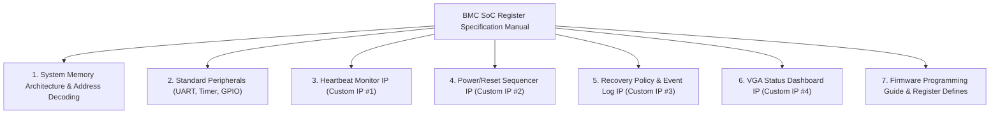

# Implementation Plan: Comprehensive SoC IP Register Map Documentation

## Goal Description
The objective is to produce an exhaustive, production-grade **Hardware Register Specification Document** for the entire BMC System-on-Chip. While [`rtl/soc_top.v`](file:///home/student/sriv_183/honour_soc/rtl/soc_top.v) contains the synthesizable parameters and top-level comments, and [`docs/Register_Map.md`](file:///home/student/sriv_183/honour_soc/docs/Register_Map.md) contains a high-level summary, the project requires a complete reference manual detailing:
- System bus topology and address decoding rules.
- Bit-level register diagrams and descriptions for every register in all 7 peripheral slaves.
- Detailed access semantics (Read/Write, Read-Only, Write-Only, self-clearing strobes, sticky flags, saturating counters).
- Register reset values, bitfield masks, and bit offsets.
- Step-by-step firmware programming sequences (e.g., how to configure detection, trigger reset, read the circular log, clear lockout, and update the VGA text dashboard).

---

## User Review Required

> [!IMPORTANT]
> **Scope & IP List**:
> The document will cover all peripherals connected to the Wishbone B4 interconnect:
> 1. **Slave 0: UART Controller** (`0x0002_0000` – `0x0002_00FF`) — 16550 register specification.
> 2. **Slave 1: Timer Peripheral** (`0x0002_0100` – `0x0002_01FF`) — Free-running 32-bit hardware counter.
> 3. **Slave 2: GPIO Peripheral** (`0x0002_0200` – `0x0002_02FF`) — Hardware pin status register.
> 4. **Slave 3: Heartbeat Monitor IP** (`0x0002_0300` – `0x0002_03FF`) — Control, threshold, status, elapsed.
> 5. **Slave 4: Power/Reset Sequencer IP** (`0x0002_0400` – `0x0002_04FF`) — Control, hold duration, status.
> 6. **Slave 5: Recovery Policy & Event Log IP** (`0x0002_0500` – `0x0002_05FF`) — Policy control, window, threshold, status, timestamp staging, circular log buffer indexing, lifetime count.
> 7. **Slave 6: VGA Status Controller IP** (`0x0002_0600` – `0x0002_06FF`) — Display control, refresh status, 120-character ASCII frame buffer.
>
> **AES Core** is excluded per your instruction.

---

## Proposed Document Structure

The document will be created as [`docs/SoC_Complete_Register_Map.md`](file:///home/student/sriv_183/honour_soc/docs/SoC_Complete_Register_Map.md) (and synced to [`docs/Register_Map.md`](file:///home/student/sriv_183/honour_soc/docs/Register_Map.md)).

### Detailed Chapter Outline:

### 1. System Memory Architecture & Bus Interconnect
- 32-bit CPU memory address map (ICCM, DCCM, Wishbone Peripheral Region).
- AXI4-Lite to Wishbone B4 Bridge operation.
- Wishbone 1-to-7 Decoder logic (`wbm_adr_i[15:8]` page selection, `[7:0]` local register offset).
- Bus timing, transaction lifecycle, and acknowledge generation.

### 2. Slave 0: UART 16550 Controller (`0x0002_0000`)
- Detailed table of all standard 16550 registers:
  - `0x00`: `RBR` (Receiver Buffer Register, RO, DLAB=0)
  - `0x00`: `THR` (Transmitter Holding Register, WO, DLAB=0)
  - `0x00`: `DLL` (Divisor Latch LSB, R/W, DLAB=1)
  - `0x04`: `IER` (Interrupt Enable Register, R/W, DLAB=0)
  - `0x04`: `DLM` (Divisor Latch MSB, R/W, DLAB=1)
  - `0x08`: `IIR` (Interrupt Identification Register, RO)
  - `0x08`: `FCR` (FIFO Control Register, WO)
  - `0x0C`: `LCR` (Line Control Register, R/W, DLAB bit)
  - `0x10`: `MCR` (Modem Control Register, R/W)
  - `0x14`: `LSR` (Line Status Register, RO)
  - `0x18`: `MSR` (Modem Status Register, RO)
  - `0x1C`: `SCR` (Scratchpad Register, R/W)
- Stub implementation behavior vs full IP behavior.

### 3. Slave 1: Timer Peripheral (`0x0002_0100`)
- `0x00` (`TMR_CTR`, RO): 32-bit free-running hardware counter.
- Resolution, overflow characteristics, and usage for event timestamping.

### 4. Slave 2: GPIO Peripheral (`0x0002_0200`)
- `0x00` (`GPIO_STAT`, RO):
  - Bit `[0]`: `heartbeat_in` live pin state.
  - Bit `[1]`: `reset_out_internal` active reset drive level.
  - Bits `[31:2]`: Reserved (`0`).

### 5. Slave 3: Heartbeat Monitor IP (`0x0002_0300`)
- **`0x00` `HB_CTRL` (R/W)**:
  - Bit `[0]` `enable` (R/W): 1 = enable monitoring FSM; 0 = disabled.
  - Bit `[1]` `clear_flag` (WO, self-clearing): 1 = clear unresponsive flag and transition to IDLE.
  - Bits `[31:2]`: Reserved (`0`).
- **`0x04` `HB_THRESHOLD` (R/W)**:
  - Bits `[31:0]` `threshold`: Maximum clock cycles between rising edges before timeout.
- **`0x08` `HB_STATUS` (RO)**:
  - Bit `[0]` `unresponsive`: Sticky flag, set when counter reaches threshold.
  - Bit `[1]` `heartbeat_in`: Live level of input pin.
  - Bits `[31:2]`: Reserved (`0`).
- **`0x0C` `HB_ELAPSED` (RO)**:
  - Bits `[31:0]` `elapsed_cycles`: Current live cycle count since last rising edge.
- Hardware FSM state transitions: `DISABLED` → `IDLE` → `COUNTING` → `UNRESPONSIVE`.

### 6. Slave 4: Power/Reset Sequencer IP (`0x0002_0400`)
- **`0x00` `RST_CTRL` (WO)**:
  - Bit `[0]` `trigger` (WO, self-clearing): 1 = start reset pulse; auto-clears next cycle.
  - Bits `[31:1]`: Reserved (`0`).
- **`0x04` `RST_HOLD_CYCLES` (R/W)**:
  - Bits `[31:0]` `hold_cycles`: Reset duration in clock cycles (default 100).
- **`0x08` `RST_STATUS` (RO)**:
  - Bit `[0]` `in_progress`: 1 = currently holding reset active-low.
  - Bit `[1]` `complete`: 1 = pulse completed; sticky until next trigger.
  - Bits `[31:2]`: Reserved (`0`).
- FSM state transitions: `IDLE` → `ASSERT` (driving 0) → `DEASSERT` (driving 1) → `DONE` → `IDLE`.

### 7. Slave 5: Recovery Policy & Event Log IP (`0x0002_0500`)
- **`0x00` `POL_CTRL` (WO)**:
  - Bit `[0]` `record_event` (WO, self-clearing): Write 1 to push staged timestamp into circular log.
  - Bit `[1]` `clear_lockout` (WO, self-clearing): Write 1 to clear lockout flag & reset window count.
  - Bits `[31:2]`: Reserved (`0`).
- **`0x04` `POL_WINDOW` (R/W)**:
  - Bits `[31:0]` `window_cycles`: Window period in clock cycles.
- **`0x08` `POL_THRESHOLD` (R/W)**:
  - Bits `[7:0]` `threshold`: Max recoveries allowed per window before lockout (default 3).
  - Bits `[31:8]`: Reserved (`0`).
- **`0x0C` `POL_STATUS` (RO)**:
  - Bit `[0]` `lockout_flag`: 1 = system locked out from automatic recovery.
  - Bits `[7:1]`: Reserved (`0`).
  - Bits `[15:8]` `window_recovery_count`: Current count of recoveries within active window.
  - Bits `[31:16]`: Reserved (`0`).
- **`0x10` `POL_EVENT_TS` (WO)**:
  - Bits `[31:0]` `staged_ts`: Staged timestamp written before asserting `POL_CTRL[0]`.
- **`0x14` `LOG_READ_IDX` (R/W)**:
  - Bits `[3:0]` `read_idx`: Read pointer index (0–15) into circular buffer.
  - Bits `[31:4]`: Reserved (`0`).
- **`0x18` `LOG_READ_DATA` (RO)**:
  - Bits `[31:0]` `entry_ts`: 32-bit timestamp at index `LOG_READ_IDX`.
- **`0x1C` `LOG_COUNT` (RO)**:
  - Bits `[31:0]` `log_count`: Lifetime cumulative event counter (saturating).
- Circular buffer wrapping logic, window counter behavior, and lockout assertion logic.

### 8. Slave 6: VGA Status Controller IP (`0x0002_0600`)
- **`0x00` `VGA_CTRL` (R/W)**:
  - Bit `[0]` `enable`: 1 = active VGA output; 0 = black/blank display.
  - Bits `[31:1]`: Reserved (`0`).
- **`0x04` `VGA_STATUS` (RO)**:
  - Bit `[0]` `refresh_flag`: 1 = buffer modified; cleared at frame start.
  - Bits `[31:1]`: Reserved (`0`).
- **`0x08`–`0x7C` `VGA_BUFFER[0:29]` (WO)**:
  - 30 words × 4 bytes = 120 ASCII characters.
  - Word index formula: `word_idx = (offset - 0x08) >> 2`.
  - Byte packing: Big-endian (MSB first: `[31:24]` char 0, `[23:16]` char 1, `[15:8]` char 2, `[7:0]` char 3).
  - Screen mapping: 3 rows × 40 columns (640x480 resolution, 8x8 font grid).

### 9. Firmware Programming Guide
- C macros for memory-mapped I/O (`REG32(addr)`).
- Complete C header definition file (`bmc_regs.h`).
- Step-by-step code recipes:
  1. Boot initialization sequence.
  2. Heartbeat monitoring & fault detection loop.
  3. Reset sequence triggering & completion polling.
  4. Event logging & window lockout check.
  5. Reading the complete 16-entry circular log.
  6. Updating the VGA text dashboard.

---

## Proposed Changes

### Documentation Component

#### [NEW] `docs/SoC_Complete_Register_Map.md`
- The exhaustive manual containing all chapters described above.

#### [MODIFY] `docs/Register_Map.md`
- Update to reflect the full specification and link directly to `SoC_Complete_Register_Map.md`.

### Firmware Header Component

#### [NEW] `firmware/include/bmc_regs.h`
- Exact C struct and macro definitions corresponding 1:1 with the documentation.

---

## Verification Plan

### Automated Verification
1. **Consistency Check**:
   - Verify every base address, register offset, and bitfield name against [`rtl/soc_top.v`](file:///home/student/sriv_183/honour_soc/rtl/soc_top.v) and each IP in [`rtl/custom_ips/`](file:///home/student/sriv_183/honour_soc/rtl/custom_ips/).
2. **C Header Compilation Check**:
   - Compile a test C program including `bmc_regs.h` with `riscv64-unknown-elf-gcc` to verify no syntax errors, valid type sizes (32-bit registers), and correct bitwise masks.
