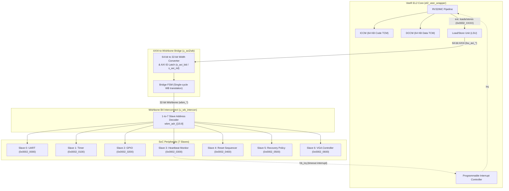

# Implementation Plan: Integrating VeeR EL2 Core with SoC Interconnect

## Goal Description
This plan establishes the architecture and step-by-step engineering implementation to integrate the **VeeR EL2 RISC-V Processor Core** with the **AXI4-to-Wishbone Bridge** and the **7-slave Wishbone Interconnect** in [`rtl/soc_top.v`](file:///home/student/sriv_183/honour_soc/rtl/soc_top.v). 

Once integrated, software running on the VeeR processor can execute load (`lw`) and store (`sw`) instructions targeting the memory-mapped peripheral range (`0x0002_0000` to `0x0002_06FF`) to configure fault detection thresholds, monitor heartbeats, trigger automated resets, inspect the circular event log, and drive the VGA status dashboard.

---

## User Review Required

> [!IMPORTANT]
> **VeeR Core Location**:
> The fully configured and built VeeR EL2 core repository is located at `/home/student/sriv_183/core/Cores-VeeR-EL2`. The placeholder folder inside the SoC repo (`/home/student/sriv_183/honour_soc/rtl/core/Cores-VeeR-EL2`) is currently empty. We propose symlinking or pulling the design files and parameters from `/home/student/sriv_183/core/Cores-VeeR-EL2` so both repositories stay perfectly in sync.

> [!WARNING]
> **AXI Bus Width & Tag Matching**:
> VeeR EL2's Load/Store Unit (LSU) issues 64-bit wide AXI transactions with transaction IDs (`lsu_axi_awid`, `lsu_axi_arid`). The AXI-to-Wishbone bridge must:
> 1. Handle 64-bit AXI to 32-bit Wishbone data steering (based on `addr[2]`).
> 2. Latch and return the transaction ID on `bid` and `rid` so the VeeR core's out-of-order store buffer can properly retire instructions.
> 3. Assert `rlast = 1'b1` on read completions.

---

## Architecture Overview



---

## Proposed Changes

### 1. Bridge Upgrade: `rtl/custom_ips/axi4_to_wb_bridge.v`

#### [MODIFY] [`axi4_to_wb_bridge.v`](file:///home/student/sriv_183/honour_soc/rtl/custom_ips/axi4_to_wb_bridge.v)
Upgrade the bridge from basic 32-bit AXI4-Lite to full AXI4 with 64-to-32 bit bus conversion and ID tag propagation:

```verilog
module axi4_to_wb_bridge #(
    parameter AXI_ADDR_WIDTH = 32,
    parameter AXI_DATA_WIDTH = 64,     // 64-bit from VeeR LSU
    parameter AXI_ID_WIDTH   = 8,      // pt.LSU_BUS_TAG
    parameter WB_ADDR_WIDTH  = 32,
    parameter WB_DATA_WIDTH  = 32      // 32-bit to Wishbone
) (
    input  wire                        clk,
    input  wire                        rst_n,

    // AXI4 Slave Interface
    input  wire [AXI_ID_WIDTH-1:0]     s_axi_awid,
    input  wire [AXI_ADDR_WIDTH-1:0]   s_axi_awaddr,
    input  wire [2:0]                  s_axi_awsize,
    input  wire                        s_axi_awvalid,
    output reg                         s_axi_awready,

    input  wire [AXI_DATA_WIDTH-1:0]   s_axi_wdata,
    input  wire [AXI_DATA_WIDTH/8-1:0] s_axi_wstrb,
    input  wire                        s_axi_wvalid,
    output reg                         s_axi_wready,

    output reg  [AXI_ID_WIDTH-1:0]     s_axi_bid,
    output reg  [1:0]                  s_axi_bresp,
    output reg                         s_axi_bvalid,
    input  wire                        s_axi_bready,

    input  wire [AXI_ID_WIDTH-1:0]     s_axi_arid,
    input  wire [AXI_ADDR_WIDTH-1:0]   s_axi_araddr,
    input  wire [2:0]                  s_axi_arsize,
    input  wire                        s_axi_arvalid,
    output reg                         s_axi_arready,

    output reg  [AXI_ID_WIDTH-1:0]     s_axi_rid,
    output reg  [AXI_DATA_WIDTH-1:0]   s_axi_rdata,
    output reg  [1:0]                  s_axi_rresp,
    output reg                         s_axi_rlast,
    output reg                         s_axi_rvalid,
    input  wire                        s_axi_rready,

    // Wishbone Master Interface (32-bit)
    output reg  [WB_ADDR_WIDTH-1:0]    wb_adr_o,
    output reg  [WB_DATA_WIDTH-1:0]    wb_dat_o,
    input  wire [WB_DATA_WIDTH-1:0]    wb_dat_i,
    output reg                         wb_we_o,
    output reg  [WB_DATA_WIDTH/8-1:0]  wb_sel_o,
    output reg                         wb_stb_o,
    output reg                         wb_cyc_o,
    input  wire                        wb_ack_i,
    input  wire                        wb_err_i
);
```

**Data steering logic in bridge**:
```verilog
// Write data steering (64-bit to 32-bit based on word address bit [2]):
always @(*) begin
    wb_dat_o = axi_addr_r[2] ? axi_wdata_r[63:32] : axi_wdata_r[31:0];
    wb_sel_o = axi_addr_r[2] ? axi_wstrb_r[7:4]   : axi_wstrb_r[3:0];
end

// Read data replication (32-bit Wishbone to 64-bit AXI):
always @(*) begin
    s_axi_rdata = {wb_rdata_r, wb_rdata_r}; // Core receives word on correct half
    s_axi_rid   = axi_arid_r;
    s_axi_rlast = 1'b1;
    s_axi_bid   = axi_awid_r;
end
```

---

### 2. Top-Level Core Instantiation: `rtl/soc_top.v`

#### [MODIFY] [`rtl/soc_top.v`](file:///home/student/sriv_183/honour_soc/rtl/soc_top.v)
Replace the placeholder comment with the actual instantiation of `el2_veer_wrapper`:

```verilog
    // ========================================================================
    // VeeR EL2 Core Instantiation
    // ========================================================================
    el2_veer_wrapper #(
        `include "el2_param.vh"
    ) u_veer (
        .clk                       (clk),
        .rst_l                     (rst_n),
        .dbg_rst_l                 (rst_n),
        .rst_vec                   (31'h4000_0000), // Boot vector
        .nmi_int                   (1'b0),
        .nmi_vec                   (31'h0),
        .jtag_id                   (31'h1),

        // LSU AXI Master -> Peripheral Bridge
        .lsu_axi_awvalid           (lsu_axi_awvalid),
        .lsu_axi_awready           (lsu_axi_awready),
        .lsu_axi_awid              (lsu_axi_awid),
        .lsu_axi_awaddr            (lsu_axi_awaddr),
        .lsu_axi_awsize            (lsu_axi_awsize),
        .lsu_axi_awlen             (lsu_axi_awlen),
        .lsu_axi_awburst           (lsu_axi_awburst),
        .lsu_axi_awprot            (lsu_axi_awprot),
        .lsu_axi_wvalid            (lsu_axi_wvalid),
        .lsu_axi_wready            (lsu_axi_wready),
        .lsu_axi_wdata             (lsu_axi_wdata),
        .lsu_axi_wstrb             (lsu_axi_wstrb),
        .lsu_axi_wlast             (lsu_axi_wlast),
        .lsu_axi_bvalid            (lsu_axi_bvalid),
        .lsu_axi_bready            (lsu_axi_bready),
        .lsu_axi_bresp             (lsu_axi_bresp),
        .lsu_axi_bid               (lsu_axi_bid),
        .lsu_axi_arvalid           (lsu_axi_arvalid),
        .lsu_axi_arready           (lsu_axi_arready),
        .lsu_axi_arid              (lsu_axi_arid),
        .lsu_axi_araddr            (lsu_axi_araddr),
        .lsu_axi_arsize            (lsu_axi_arsize),
        .lsu_axi_arlen             (lsu_axi_arlen),
        .lsu_axi_arburst           (lsu_axi_arburst),
        .lsu_axi_arprot            (lsu_axi_arprot),
        .lsu_axi_rvalid            (lsu_axi_rvalid),
        .lsu_axi_rready            (lsu_axi_rready),
        .lsu_axi_rid               (lsu_axi_rid),
        .lsu_axi_rdata             (lsu_axi_rdata),
        .lsu_axi_rresp             (lsu_axi_rresp),
        .lsu_axi_rlast             (lsu_axi_rlast),

        // Unused bus ports tied off
        .ifu_axi_awready           (1'b0),
        .ifu_axi_wready            (1'b0),
        .ifu_axi_bvalid            (1'b0),
        .ifu_axi_bresp             (2'b0),
        .ifu_axi_arready           (1'b0),
        .ifu_axi_rvalid            (1'b0),
        .ifu_axi_rdata             (64'b0),
        .ifu_axi_rresp             (2'b0),
        .ifu_axi_rlast             (1'b0),
        .dma_axi_awvalid           (1'b0),
        .dma_axi_wvalid            (1'b0),
        .dma_axi_bready            (1'b0),
        .dma_axi_arvalid           (1'b0),
        .dma_axi_rready            (1'b0),

        // Clock ratios (1:1)
        .lsu_bus_clk_en            (1'b1),
        .ifu_bus_clk_en            (1'b1),
        .dbg_bus_clk_en            (1'b1),
        .dma_bus_clk_en            (1'b1),

        // Interrupts
        .timer_int                 (1'b0),
        .soft_int                  (1'b0),
        .extintsrc_req             ({30'b0, hb_irq}), // Heartbeat timeout IRQ

        // JTAG
        .jtag_tck                  (jtag_tck),
        .jtag_tms                  (jtag_tms),
        .jtag_tdi                  (jtag_tdi),
        .jtag_trst_n               (rst_n),
        .jtag_tdo                  (jtag_tdo),
        .jtag_tdoEn                (),

        // Memory interfaces (ICCM, DCCM, ICache behavioral RAMs)
        .el2_mem_export            (el2_mem_export),
        .el2_icache_export         (el2_icache_export),

        // MPC / debug run control
        .mpc_debug_halt_req        (1'b0),
        .mpc_debug_run_req         (1'b1),
        .mpc_reset_run_req         (1'b1),
        .i_cpu_halt_req            (1'b0),
        .i_cpu_run_req             (1'b1),
        .scan_mode                 (1'b0),
        .mbist_mode                (1'b0)
    );
```

---

### 3. Build & Simulation Setup

#### [NEW] `Makefile` targets for Synopsys VCS
- Include search paths:
  `-I/home/student/sriv_183/core/Cores-VeeR-EL2/snapshots/default`
  `-I/home/student/sriv_183/core/Cores-VeeR-EL2/design/include`
  `-I/home/student/sriv_183/core/Cores-VeeR-EL2/design/lib`
- Add VeeR design file list and RAM models.
- Target `make sim_soc_veer`: Builds full SoC with VeeR core and runs bare-metal C hex program.

---

## Verification Plan

### Automated Verification
1. **RTL Syntax & Elaboration Check**:
   ```bash
   vcs -sverilog -full64 +v2k \
       -Isnapshots/default -Idesign/include -Idesign/lib \
       rtl/soc_top.v rtl/custom_ips/*.v \
       -kdb -o simv_soc_veer
   ```
   *Success criteria*: 0 errors, 0 warnings.

2. **End-to-End MMIO Test**:
   - Compile a minimal test program that writes to `HB_THRESHOLD` (`0x0002_0304`) and `HB_CTRL` (`0x0002_0300`), then reads back `HB_STATUS` (`0x0002_0308`).
   - Run simulation and verify:
     - `lsu_axi_awvalid` pulses with address `0x0002_0304`.
     - Bridge forwards to Wishbone `wbs3_stb & wbs3_cyc`.
     - Heartbeat Monitor acknowledges with `wbs3_ack`.
     - VeeR core receives `lsu_axi_bvalid` with matching `bid` and continues execution.

### Manual Verification
- Open Verdi to inspect the complete bus handshake across the boundary:
  ```bash
  verdi -ssf dump.fsdb -dbdir simv_soc_veer.daidir &
  ```
  - Trace `u_veer.lsu_axi_*` → `u_axi2wb` → `u_wb_intercon` → `u_heartbeat`.
