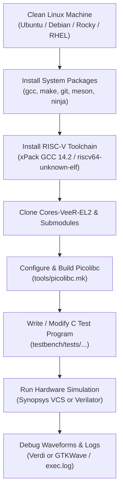

# Cores-VeeR-EL2: Clean Computer Setup & C Simulation Guide

This guide walks you through setting up a **brand-new, clean Linux computer** from scratch to compile and simulate custom C programs on the **Cores-VeeR-EL2** RISC-V core.

---

## Architecture Overview



---

## 1. System Requirements & Base Packages

### 1.1 Supported Linux Distributions
- **Ubuntu 20.04 / 22.04 / 24.04** or **Debian 11 / 12**
- **Rocky Linux 8 / 9**, **RHEL 8 / 9**, or **CentOS Stream**

### 1.2 Package Installation

#### On Ubuntu / Debian:
```bash
sudo apt update && sudo apt install -y \
    build-essential \
    git \
    make \
    curl \
    wget \
    tar \
    xz-utils \
    python3 \
    python3-pip \
    ninja-build \
    libfl-dev \
    zlib1g-dev

# Install Meson via pip (ensures latest version for picolibc)
pip3 install --user meson ninja
```

#### On Rocky Linux / RHEL / CentOS:
```bash
sudo dnf install -y \
    gcc \
    gcc-c++ \
    git \
    make \
    curl \
    wget \
    tar \
    xz \
    python3 \
    python3-pip \
    flex \
    bison \
    zlib-devel

pip3 install --user meson ninja
```

---

## 2. Installing the RISC-V Cross-Compiler Toolchain

Instead of waiting hours to compile `riscv-gnu-toolchain` from source, use the official, standalone, pre-built **xPack GNU RISC-V Embedded GCC** release. It works on all modern and enterprise Linux distributions.

### 2.1 Download and Extract the Toolchain
```bash
# 1. Create a local installation folder
mkdir -p ~/.local/riscv
cd ~/.local/riscv

# 2. Download the pre-built xPack GCC archive (v14.2.0-2)
wget https://github.com/xpack-dev-tools/riscv-none-elf-gcc-xpack/releases/download/v14.2.0-2/xpack-riscv-none-elf-gcc-14.2.0-2-linux-x64.tar.gz

# 3. Extract the archive
tar -xzf xpack-riscv-none-elf-gcc-14.2.0-2-linux-x64.tar.gz
rm -f xpack-riscv-none-elf-gcc-14.2.0-2-linux-x64.tar.gz
```

### 2.2 Create Global Symlinks
VeeR's build system looks for `riscv64-unknown-elf-*` by default, while xPack provides binaries named `riscv-none-elf-*`. To support both seamlessly:

```bash
mkdir -p ~/.local/bin
XDIR=~/.local/riscv/xpack-riscv-none-elf-gcc-14.2.0-2/bin

for tool in addr2line ar as c++ c++filt cpp elfedit g++ gcc gcc-ar gcc-nm gcc-ranlib gcov gcov-dump gcov-tool gdb gprof ld ld.bfd nm objcopy objdump ranlib readelf size strings strip; do
  ln -sf $XDIR/riscv-none-elf-$tool ~/.local/bin/riscv-none-elf-$tool
  ln -sf $XDIR/riscv-none-elf-$tool ~/.local/bin/riscv64-unknown-elf-$tool
  ln -sf $XDIR/riscv-none-elf-$tool ~/.local/bin/riscv32-unknown-elf-$tool
done
```

### 2.3 Configure `~/.bashrc`
Add `~/.local/bin` to your system `PATH`:

```bash
cat << 'EOF' >> ~/.bashrc

# RISC-V Cross-Compiler PATH
export PATH=$HOME/.local/bin:$PATH
EOF

source ~/.bashrc
```

Verify that GCC is accessible:
```bash
riscv64-unknown-elf-gcc --version
# Output: riscv64-unknown-elf-gcc (xPack GNU RISC-V Embedded GCC x86_64) 14.2.0
```

---

## 3. Simulator Setup

You can simulate VeeR-EL2 using **Synopsys VCS** (commercial) or **Verilator** (open-source).

### Option A: Synopsys VCS (Commercial)
Ensure your environment variables are configured in `~/.bashrc`:
```bash
cat << 'EOF' >> ~/.bashrc

# Synopsys License & Tools
export SNPSLMD_LICENSE_FILE=27021@your-license-server
export VCS_HOME=/path/to/vcs/U-2023.03
export VERDI_HOME=/path/to/verdi/U-2023.03-SP1
export PATH=$VCS_HOME/bin:$VERDI_HOME/bin:$PATH
EOF

source ~/.bashrc
```

### Option B: Verilator (100% Free & Open-Source)
If you do not have Synopsys VCS, install Verilator (version 5.006 or newer recommended):
```bash
# Ubuntu:
sudo apt install -y verilator

# Or build from source for the latest version:
git clone https://github.com/verilator/verilator
cd verilator
git checkout v5.020
autoconf
./configure
make -j$(nproc)
sudo make install
```

---

## 4. Cloning the Repository

Clone the `Cores-VeeR-EL2` repository recursively to pull in all required submodules (including `picolibc` and test benches):

```bash
git clone --recursive https://github.com/chipsalliance/Cores-VeeR-EL2.git
cd Cores-VeeR-EL2

# If already cloned without --recursive:
git submodule update --init --recursive
```

Set the repository root environment variable:
```bash
export RV_ROOT=$(pwd)
echo "export RV_ROOT=$RV_ROOT" >> ~/.bashrc
```

---

## 5. Core Configuration & Picolibc Setup

### 5.1 Update `tools/picolibc.mk` for GCC 14
Modern GCC multilib configurations default to `rv32imac/ilp32` as root (`.`). In [tools/picolibc.mk](file:///home/student/sriv_183/core/Cores-VeeR-EL2/tools/picolibc.mk#L44-L46), ensure Meson is configured with `-Dmultilib=false`:

```makefile
$(INSTALL_PATH)/picolibc.specs: $(BUILD_PATH)/cross.txt | $(BUILD_PATH)
	cd $(PICOLIBC_PATH) && meson $(BUILD_PATH) \
		-Dmultilib=false \
		-Dpicocrt=false \
		-Datomic-ungetc=false \
		-Dthread-local-storage=false \
		-Dio-long-long=true \
		-Dformat-default=integer \
		-Dincludedir=picolibc/$(GCC_PREFIX)/include \
		-Dlibdir=picolibc/$(GCC_PREFIX)/lib \
        -Dprefix=$(INSTALL_PATH) \
        -Dspecsdir=$(INSTALL_PATH) \
		--cross-file $(BUILD_PATH)/cross.txt

	cd $(BUILD_PATH) && meson install
```

### 5.2 Build and Install Picolibc
Run the picolibc build target:
```bash
make -f tools/picolibc.mk all
```
*This installs `picolibc.specs`, headers, and precompiled libraries into `third_party/picolibc/install`.*

---

## 6. Understanding Core Snapshots (`make clean`)

VeeR uses a configuration generator `configs/veer.config` to produce RTL headers (`defines.h`, `el2_param.vh`, `common_defines.vh`) in `snapshots/default/`.

> [!WARNING]
> In `tools/Makefile`, `defines.h` is only generated if the file does **not** already exist. 
> Whenever switching hardware configuration flags (such as adding `USER_MODE=1` or changing cache sizes), **always run `make clean` first**:
> ```bash
> make -f tools/Makefile clean
> ```

---

## 7. Writing & Customizing C Test Code

Test programs are located in `testbench/tests/<test_name>/`.
For example: [testbench/tests/csr_access/csr_access.c](file:///home/student/sriv_183/core/Cores-VeeR-EL2/testbench/tests/csr_access/csr_access.c).

### 7.1 Key Rules for VeeR Bare-Metal C Code

1. **CSR Addresses Must Be 12 Bits:**
   In RISC-V, CSR instructions (`csrr`, `csrw`) encode the register address in a 12-bit field (`0x000` to `0xFFF`).
   ```c
   // Correct:
   _write_csr(0xFFF, 0xDEADBEEF);
   _write_csr(mscratch, 0x12345678);

   // WRONG (will cause assembler error):
   _write_csr(0xFFFFFFFF, 0xDEADBEEF);
   ```

2. **Using `printf`:**
   Output is sent across the simulated console. Always terminate strings with `\n` to flush the buffer:
   ```c
   printf("\nHello from Custom C Firmware on VeeR-EL2!\n");
   ```

3. **Traps & Exceptions:**
   Accessing unprivileged registers from User Mode automatically jumps to the trap handler defined in `csr_access.c`:
   ```c
   void trap_handler() {
       unsigned long mcause = _read_csr(mcause);
       // mcause == 0x2 -> Illegal instruction
   }
   ```

---

## 8. Compiling & Simulating

### 8.1 Simulating with Synopsys VCS
```bash
cd $RV_ROOT

# Step 1: Clean old snapshots if hardware flags changed
make -f tools/Makefile clean

# Step 2: Build firmware + RTL and execute
make -f tools/Makefile vcs TEST=csr_access USER_MODE=1 debug=1
```

### 8.2 Simulating with Open-Source Verilator
```bash
cd $RV_ROOT
make -f tools/Makefile clean
make -f tools/Makefile verilator TEST=csr_access USER_MODE=1 debug=1
```

---

## 9. Verifying Results & Viewing Waveforms

### 9.1 Verification Banner
When execution finishes, you should see:
```text
[297000 ns] Hello VeeR
[1322000 ns] trap! mstatus=0x00001800, mcause=0x00000002
[9687000 ns] DeadBeef
...
[1676419000 ns] 
[1676535000 ns] TEST_PASSED
Finished : minstret = 314752, mcycle = 1676527
```

### 9.2 Inspecting the Instruction Trace (`exec.log`)
Inspect every instruction executed by the core:
```bash
less exec.log
```

### 9.3 Viewing Waveforms in Synopsys Verdi
Because you specified `debug=1`, VCS generated the Knowledge Database (`simv.daidir`) and signal dump (`dump.fsdb`):

```bash
verdi -ssf dump.fsdb -dbdir simv.daidir &
```

In Verdi:
- Press **`Ctrl + W`** to open the waveform display (**nWave**).
- Drag signals from `tb_top.rvtop.veer` into the waveform viewer.

---

## 10. Summary Quick-Start Checklist

For any new machine or fresh terminal:

```bash
# 1. Ensure tools are in PATH
which riscv64-unknown-elf-gcc
which vcs

# 2. Set repository root
cd /path/to/Cores-VeeR-EL2
export RV_ROOT=$(pwd)

# 3. Edit your C code in testbench/tests/csr_access/csr_access.c

# 4. Run the simulation
make -f tools/Makefile vcs TEST=csr_access USER_MODE=1 debug=1
```
