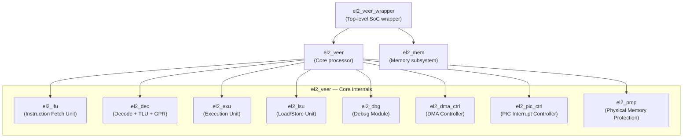
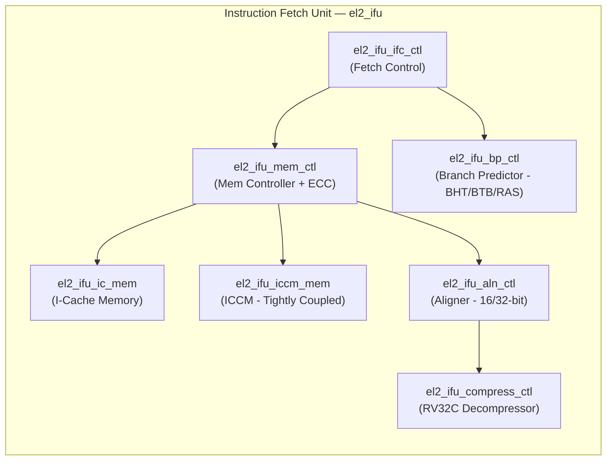
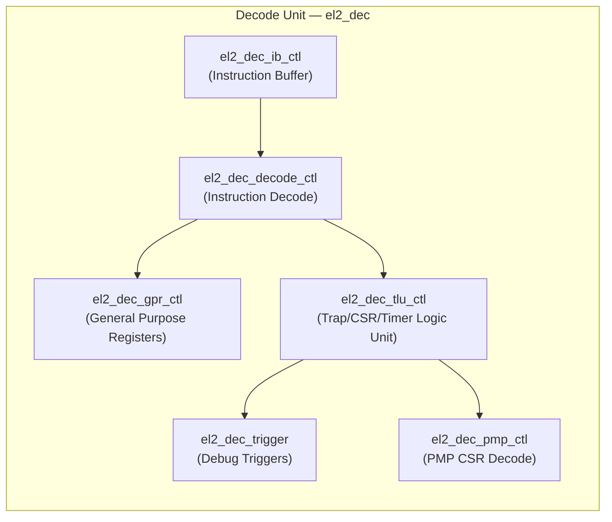
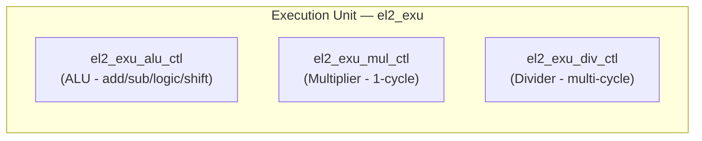
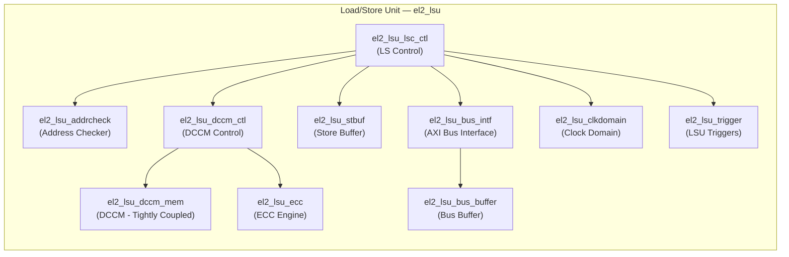
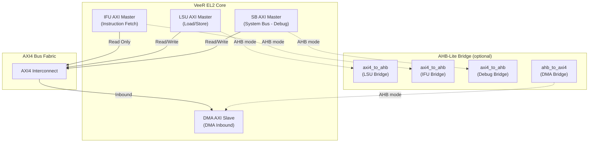
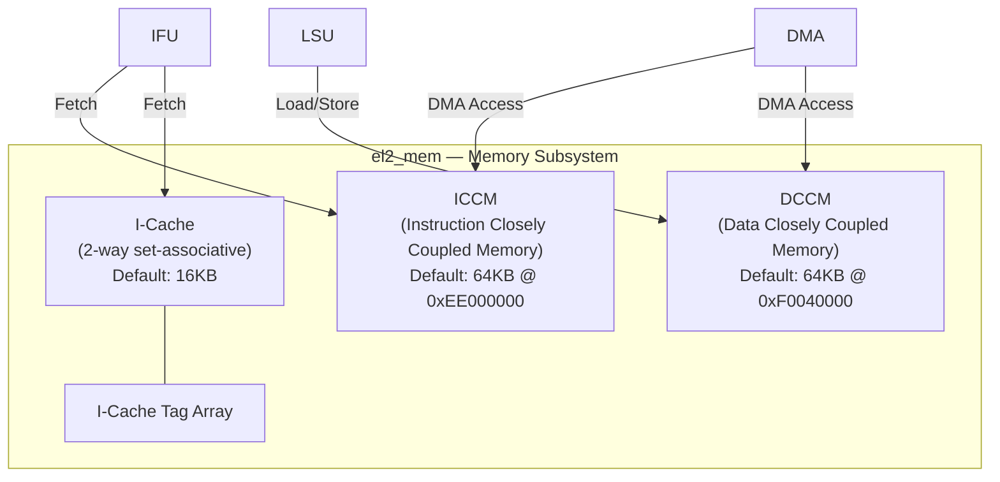
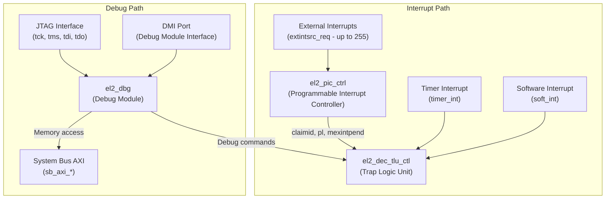
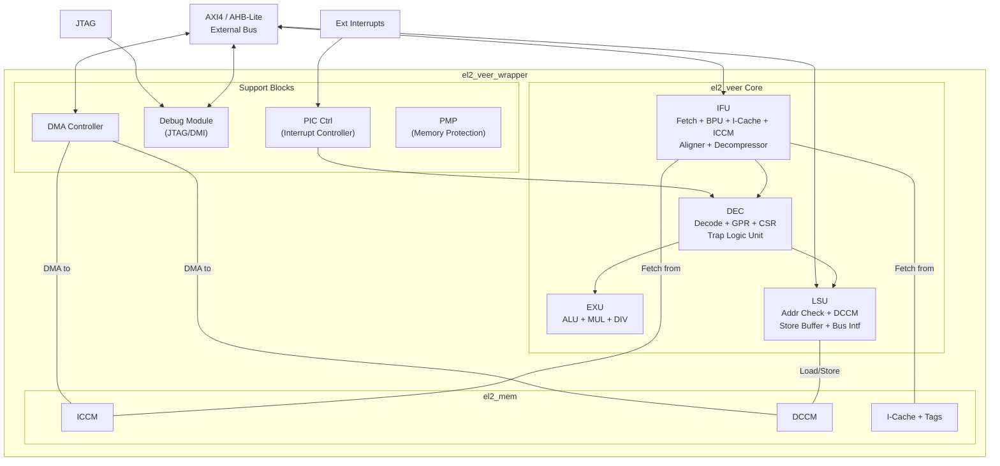

# VeeR EL2 Processor — Architectural Diagram

> [!NOTE]
> This diagram was derived by analyzing the actual SystemVerilog source code in [`rtl/core/Cores-VeeR-EL2/design/`](file:///e:/Projects/honours_project/rtl/core/Cores-VeeR-EL2/design). All module names and hierarchies match the RTL.

## 1. Top-Level Module Hierarchy

---

## 2. Detailed Pipeline Architecture

The VeeR EL2 is a **9-stage, dual-issue capable, in-order pipeline** (RV32IMC).

---

## 3. Bus Interface Architecture

The VeeR EL2 supports **both AXI4 and AHB-Lite** via compile-time defines (`RV_BUILD_AXI4` / `RV_BUILD_AHB_LITE`).

---

## 4. Memory Subsystem

---

## 5. Interrupt & Debug Architecture

---

## 6. Complete Data Flow Summary

---

## 7. Key Source File Reference

| Module | Source File | Purpose |
|---|---|---|
| `el2_veer_wrapper` | [`el2_veer_wrapper.sv`](file:///e:/Projects/honours_project/rtl/core/Cores-VeeR-EL2/design/el2_veer_wrapper.sv) | Top-level wrapper with AXI/AHB ports |
| `el2_veer` | [`el2_veer.sv`](file:///e:/Projects/honours_project/rtl/core/Cores-VeeR-EL2/design/el2_veer.sv) | Core processor, instantiates all units |
| `el2_mem` | [`el2_mem.sv`](file:///e:/Projects/honours_project/rtl/core/Cores-VeeR-EL2/design/el2_mem.sv) | Memory subsystem (ICCM, DCCM, I-Cache) |
| `el2_ifu` | [`el2_ifu.sv`](file:///e:/Projects/honours_project/rtl/core/Cores-VeeR-EL2/design/ifu/el2_ifu.sv) | Instruction Fetch Unit |
| `el2_dec` | [`el2_dec.sv`](file:///e:/Projects/honours_project/rtl/core/Cores-VeeR-EL2/design/dec/el2_dec.sv) | Decode, GPR, TLU, Triggers |
| `el2_exu` | [`el2_exu.sv`](file:///e:/Projects/honours_project/rtl/core/Cores-VeeR-EL2/design/exu/el2_exu.sv) | Execution: ALU, MUL, DIV |
| `el2_lsu` | [`el2_lsu.sv`](file:///e:/Projects/honours_project/rtl/core/Cores-VeeR-EL2/design/lsu/el2_lsu.sv) | Load/Store Unit |
| `el2_dbg` | [`el2_dbg.sv`](file:///e:/Projects/honours_project/rtl/core/Cores-VeeR-EL2/design/dbg/el2_dbg.sv) | Debug Module (JTAG + System Bus) |
| `el2_dma_ctrl` | [`el2_dma_ctrl.sv`](file:///e:/Projects/honours_project/rtl/core/Cores-VeeR-EL2/design/el2_dma_ctrl.sv) | DMA Controller |
| `el2_pic_ctrl` | [`el2_pic_ctrl.sv`](file:///e:/Projects/honours_project/rtl/core/Cores-VeeR-EL2/design/el2_pic_ctrl.sv) | Programmable Interrupt Controller |
| `el2_pmp` | [`el2_pmp.sv`](file:///e:/Projects/honours_project/rtl/core/Cores-VeeR-EL2/design/el2_pmp.sv) | Physical Memory Protection |
| `axi4_to_ahb` | [`axi4_to_ahb.sv`](file:///e:/Projects/honours_project/rtl/core/Cores-VeeR-EL2/design/lib/axi4_to_ahb.sv) | AXI4→AHB-Lite bridge |
| `ahb_to_axi4` | [`ahb_to_axi4.sv`](file:///e:/Projects/honours_project/rtl/core/Cores-VeeR-EL2/design/lib/ahb_to_axi4.sv) | AHB-Lite→AXI4 bridge |
